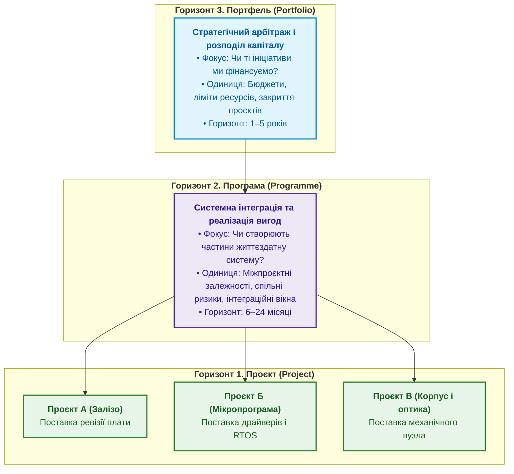

# Глава 2. Три горизонти: проєкт, програма, портфель і межі їхніх рішень

> **Книга:** [Керування складними інженерними проєктами та програмами](README.md) · [Частина I](part-01-foundations-and-systems-model.md)  
> **Попередня глава:** [Глава 1. Криза статусів: чому традиційний проєктний менеджмент не рятує складні вироби](ch01-engineering-management-in-crisis.md)  
> **Наступна глава:** [Глава 3. Цифрова нитка та єдина модель даних інженерного підприємства](ch03-digital-thread-and-engineering-data-model.md)  
> **Зміст книги:** [README.md](README.md)  
> **Автор:** [Микола Федчик](about-the-author.md)  
> **Рівень:** інженерні лідери, програмні менеджери, керівники PMO, технічні директори  
> **Очікувані результати:** чітко розмежовувати об'єкти управління та межі рішень на рівнях проєкту, програми й портфеля; уникати заміни програмного менеджменту механічним додаванням проєктних звітів; ідентифікувати приховані конфлікти ресурсів і системні ризики; проєктувати багаторівневу структуру управління інженерною організацією.

---

## Чому програма не є «великим проєктом»

Поширена помилка організацій полягає в спробі масштабувати проєктний менеджмент шляхом простого укрупнення: призначити старшого проєктного менеджера та додати ще одну колонку у зведену таблицю. Коли виникає складна інженерна ініціатива (створення нового безпілотного авіаційного комплексу, розгортання платформи автономного транспорту чи розробка медичного томографа), керівництво вважає, що перед ними звичайний проєкт, лише з більшим бюджетом і командою.

Ця підміна понять гарантовано призводить до системного збою. Причина полягає в тому, що проєкт, програма та портфель діють на різних горизонтах управління, оперують різними сутностями й оптимізують різні критерії успіху.



Розглянемо специфіку кожного горизонту та типові пастки їхнього змішування.

---

## Горизонт 1. Проєкт: фокус на поставці результату (Output)

Проєкт є тимчасовим підприємством, спрямованим на створення окремого продукту, послуги або результату в межах заданого часу, бюджету й вимог [[1]](#src-1).

Проєктний менеджер відповідає за чітко окреслену ділянку роботи:

* **Головне запитання менеджера проєкту:** «Чи поставить команда затверджений обсяг робіт у визначений строк і в межах виділеного бюджету?».
* **Об'єкти управління:** завдання, оцінки трудомісткості, робочі пакети WBS, спринти, локальні ризики розробки, продуктивність конкретних інженерів.
* **Критерій успіху:** поставка матеріального чи програмного результату (*Output*), що відповідає специфікації вимог.

Якщо команда проєкту розробляє модуль обчислювача навігації, її результатом є змонтована плата із завантаженим завантажувачем і звітом про проходження базових тестів електричної цілісності. Команда виконала свій контракт. Проте сама по собі ця плата ще не створює цінності для кінцевого користувача, доки не інтегрована з антеною, датчиками, корпусом і суміжними алгоритмами.

---

## Горизонт 2. Програма: фокус на системній інтеграції та вигодах (Outcome)

Програма є групою пов'язаних проєктів, додаткових програм і програмних заходів, управління якими координується для отримання вигод, недосяжних під час окремого управління кожним проєктом [[2]](#src-2).

Програмний менеджер працює на іншому рівні абстракції:

* **Головне запитання програмного менеджера:** «Чи забезпечать усі створені підсистеми разом працездатний продукт, який принесе стратегічну користь організації та користувачеві?».
* **Об'єкти управління:** міжпроєктні залежності, критичний шлях інтеграції, спільні системні ризики, інтеграційні вікна, розділення ресурсів спеціального обладнання (випробувальних лабораторій, верстатів, стендів HIL), реалізація вигод (*Benefits Realization*).
* **Критерій успіху:** досягнення життєздатного системного стану (*Outcome*), наприклад: комплекс успішно виконує автономну місію в польових умовах без супутникової навігації.

### Чому небезпечна підміна програми агрегацією статусів

Якщо в компанії немає справжнього програмного управління, його намагаються замінити зведенням статусів окремих проєктів. Виникає небезпечна ілюзія:

Нехай програма об'єднує $m$ взаємопов'язаних підпроєктів. Якщо статус кожного підпроєкту оцінюється локальною ймовірністю своєчасного завершення $p_i$, то загальна ймовірність успіху системної інтеграції без координації залежностей падає за експоненційним законом:

```math
P_{\text{programme}}=\prod_{i=1}^{m}p_i.
```

Позначення:

- $P_{\text{programme}}$ є загальною ймовірністю успішного завершення інтеграції програми у визначений строк;
- $m$ є кількістю взаємозалежних підпроєктів у складі програми;
- $p_i \in [0, 1]$ є ймовірністю своєчасного виконання $i$-го підпроєкту;
- $\prod_{i=1}^{m}$ означає мультиплікативний зв'язок: затримка будь-якого критичного підпроєкту зриває загальне інтеграційне вікно.

Якщо програма складається з 6 підпроєктів, і кожен проєктний менеджер оцінює свою готовність як високу ($p_i = 0{,}90$), загальна ймовірність своєчасної інтеграції програми без активного управління міжпроєктними зв'язками становить:

$$P_{\text{programme}} = 0{,}90^6 \approx 0{,}531.$$

Майже з імовірністю підкидання монети (53 %) програма зірве контрольний пункт. При цьому кожен окремий менеджер прийде на нараду із зеленим звітом і буде щиро переконаний, що підвела суміжна команда.

---

## Горизонт 3. Портфель: фокус на стратегічному арбітражі та капіталі

Портфель об'єднує проєкти, програми, підпортфелі та операційну діяльність, якими керують як групою для досягнення стратегічних цілей організації [[3]](#src-3).

Портфельний керівник (часто за участі технічного директора й фінансового директора) відповідає за стратегічну відповідність і збереження життєздатності бізнесу:

* **Головне запитання портфельного комітету:** «Чи в ті ініціативи ми інвестуємо обмежені гроші, виробничі спроможності й дефіцитний інженерний час?».
* **Об'єкти управління:** ліміти капітальних інвестицій (CapEx) та операційних витрат (OpEx), пропускна здатність провідних спеціалістів, відповідність бізнес-стратегії, критерії відкриття й закриття ініціатив.
* **Критерій успіху:** максимальне повернення на інвестований капітал (ROI) за прийнятного рівня ризику в межах стратегічного горизонту.

Найскладніше завдання портфельного управління полягає не у виборі нових цікавих проєктів, а в своєчасному **закритті неперспективних розробок**. В інженерних організаціях діє психологічний ефект неповоротних витрат (*Sunk Cost Fallacy*): оскільки на макет витрачено рік праці й сотні тисяч доларів, інженери й керівники вимагають продовжувати фінансування навіть тоді, коли ринок змінився або з'явилася дешевша альтернатива.

---

## Порівняльна матриця трьох горизонтів

Щоб уникнути організаційної плутанини, зафіксуємо розмежування характеристик у зведеній таблиці:

| Параметр | Проєкт (Project) | Програма (Programme) | Портфель (Portfolio) |
| :--- | :--- | :--- | :--- |
| **Головна мета** | Створення конкретного виробу чи вузла | Отримання сукупної системної вигоди | Максимізація цінності та стратегічний розвиток |
| **Фокус уваги** | Вміст робіт, строк, бюджет, якість | Інтерфейси, спільні ризики, інтеграція | Розподіл капіталу, баланс ризиків, пріоритети |
| **Успіх вимірюється** | Дотриманням розкладу та специфікації | Досягненням працездатності комплексу | Ринковими, економічними й оборонними ефектами |
| **Головний артефакт** | WBS, розклад завдань, робочий пакет | Карта залежностей, інтеграційні вікна | Реєстр ініціатив, матриця інвестицій |
| **Реакція на зміну** | Оцінка локального впливу на строк і кошти | Коригування критичного шляху та інтерфейсів | Перерозподіл бюджетів або закриття проєкту |
| **Горизонт планування** | Дні, тижні, місяці | Квартали, роки | Роки, п'ятирічки |

---

## Типові системні конфлікти між горизонтами

Коли межі рішень не визначені, організація занурюється у внутрішні суперечки. Розглянемо два найпоширеніших конфлікти:

### Конфлікт 1. Оптимізація проєкту коштом програми

Проєктний менеджер апаратної плати прагне мінімізувати вартість компонентів, щоб вкластися у виділений бюджет BOM. Він обирає дешевший мікроконтролер із меншим обсягом оперативної пам'яті. Локально проєкт плати показує економію коштів.

Але на програмному рівні це рішення спричиняє катастрофу: команді розробників прошивки не вистачає пам'яті для розміщення безпекового стека протоколів. Програмісти змушені витратити два місяці на складну ручну оптимізацію асемблерного коду. Економія 5 доларів на мікросхемі призводить до додаткових витрат 40 000 доларів на фонд оплати праці програмістів і зриває вихід комплексу на сертифікацію.

### Конфлікт 2. Перевантаження портфеля через відсутність лімітів WIP

Портфельний комітет відкриває 15 паралельних інженерних ініціатив, оскільки кожна з них виглядає привабливою для інвесторів. Проте в компанії є лише одна лабораторія електромагнітної сумісності (EMC) і два провідні архітектори з безпеки.

У результаті всі 15 проєктів зупиняються в черзі на випробування. Час циклу розробки зростає вчетверо, а інженери витрачають до 40 % робочого часу на нескінченне перемикання контексту між проєктами. Портфель формально переповнений діяльністю, але жоден виріб не виходить на ринок.

---

## Висновок

Проєкт, програма та портфель є взаємодоповнюючими, але принципово відмінними інструментами інженерного керівництва. Проєкт гарантує створення якісних компонентів; програма об'єднує ці компоненти в узгоджену систему; портфель забезпечує, щоб зусилля організації були спрямовані на створення найважливіших продуктів.

Спроба підмінити програмне управління сумою проєктних статусів маскує експоненційне падіння системної надійності під час інтеграції. Щоб координувати ці горизонти на практиці, організації потрібна не нова серія статус-нарад, а єдиний спільний знаменник даних, який пов'язує вимоги, зміни й артефакти між усіма рівнями.

У наступній главі ми дослідимо цей спільний знаменник: архітектуру цифрової нитки (*digital thread*) та модель спільних інженерних даних.

---

## Питання для обговорення

1. У чому полягає принципова різниця між результатом проєкту (Output) і стратегічним наслідком програми (Outcome)? Наведіть приклад з власної практики.
2. Чому висока індивідуальна готовність окремих підпроєктів (наприклад, понад 90 %) не гарантує успішної та своєчасної системної інтеграції виробу?
3. Які специфічні ризики бере на себе програмний менеджер, які не входять до зони відповідальності окремих проєктних менеджерів?
4. Чому закриття неефективного проєкту на портфельному рівні є ознакою управлінської зрілості організації, а не її слабкості?
5. Які механізми арбітражу між інтересами локальної економії проєкту та системними витратами програми діють у вашій інженерній структурі?

---

## Словник

- **Горизонт управління:** часовий і структурний масштаб прийняття рішень у системній ієрархії організації (оперативний рівень проєкту, тактичний рівень програми, стратегічний рівень портфеля).
- **Інтеграційне вікно (Integration Window):** фіксований календарний інтервал, протягом якого готові ревізії апаратних, програмних і механічних підсистем об'єднуються на стенді для спільної верифікації сумісності.
- **Міжпроєктна залежність:** зв'язок між роботами двох різних команд, коли початок або якісне завершення задачі в одному проєкті вимагає поставки артефакта з іншого проєкту.
- **Портфель проєктів і програм:** сукупність програм, проєктів та операційної діяльності підприємства, згрупованих для ефективного стратегічного управління та розподілу капіталу.
- **Програма:** сукупність споріднених інженерних проєктів, узгоджене управління якими дозволяє мінімізувати спільні ризики та отримати системні вигоди, недосяжні під час ізольованої роботи.
- **Пулінг ризиків (Risk Pooling):** практика об'єднання однорідних невизначеностей і резервів на рівні програми для зниження сумарних витрат на страхування ризиків окремих підпроєктів.
- **Реалізація вигод (Benefits Realization):** процес контролю та оцінки досягнення запланованих бізнес-результатів або експлуатаційних переваг після передавання створеного продукту замовникові.
- **Системний результат (Outcome):** стан працездатності, цінності та поведінки інтегрованого комплексу в реальному середовищі, на відміну від проміжного матеріального артефакта.

---

## Абревіатури

- **BOM** (*Bill of Materials*): специфікація компонентів і матеріалів виробу.
- **CapEx** (*Capital Expenditure*): капітальні витрати на обладнання, оснащення та довгострокові активи.
- **EMC** (*Electromagnetic Compatibility*): електромагнітна сумісність електронних пристроїв.
- **HIL** (*Hardware-in-the-Loop*): випробувальний стенд із включенням реального апаратного блоку в симуляційне середовище.
- **JTAG** (*Joint Test Action Group*): апаратний інтерфейс налагодження та тестування плат.
- **OpEx** (*Operational Expenditure*): поточні операційні витрати на забезпечення діяльності.
- **PMO** (*Project/Program Management Office*): офіс управління проєктами та програмами.
- **ROI** (*Return on Investment*): коефіцієнт рентабельності інвестицій.
- **RTOS** (*Real-Time Operating System*): операційна система реального часу.
- **WBS** (*Work Breakdown Structure*): ієрархічна структура декомпозиції робіт проєкту.
- **WIP** (*Work In Progress*): незавершене виробництво (кількість задач, що перебувають у роботі одночасно).

---

## Джерела

1. <a id="src-1"></a>Project Management Institute. [*A Guide to the Project Management Body of Knowledge (PMBOK Guide)*](https://www.pmi.org/pmbok-guide-standards/foundational/pmbok), 7th Edition. PMI, 2021.
2. <a id="src-2"></a>Project Management Institute. [*The Standard for Program Management*](https://www.pmi.org/pmbok-guide-standards/foundational/program-management), 4th Edition. PMI, 2017.
3. <a id="src-3"></a>Project Management Institute. [*The Standard for Portfolio Management*](https://www.pmi.org/pmbok-guide-standards/foundational/portfolio-management), 4th Edition. PMI, 2017.
4. <a id="src-4"></a>International Council on Systems Engineering. [*INCOSE Systems Engineering Handbook: A Guide for System Life Cycle Processes and Activities*](https://doi.org/10.1002/9781119516828), 4th Edition. Wiley, 2015.
5. <a id="src-5"></a>Robert G. Cooper. [*Winning at New Products: Creating Value Through Innovation*](https://www.basicbooks.com/), 5th Edition. Basic Books, 2017.

---

[← До змісту книги](README.md) | [Частина I](part-01-foundations-and-systems-model.md) | [Глава 3 →](ch03-digital-thread-and-engineering-data-model.md)
