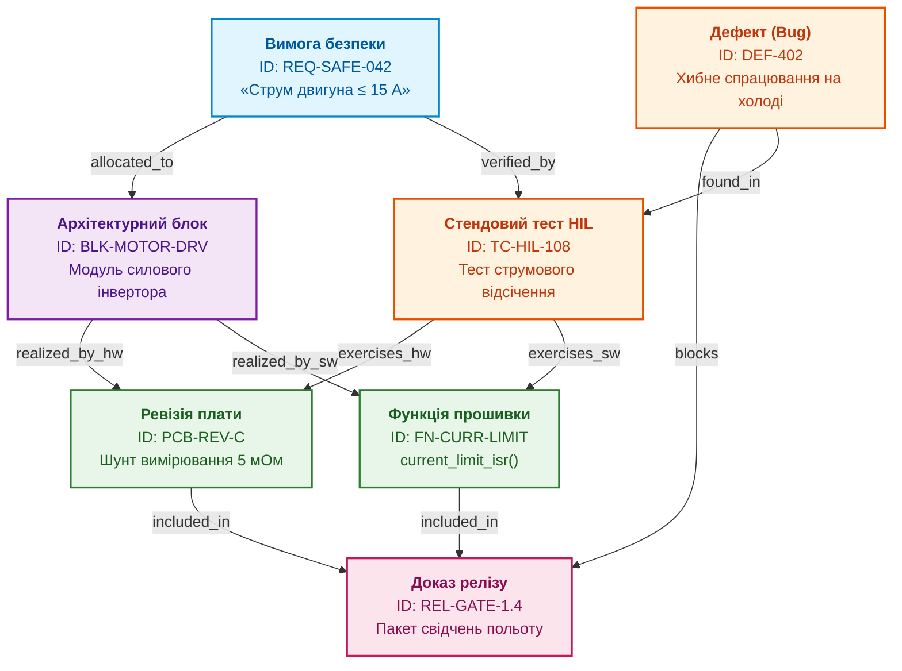
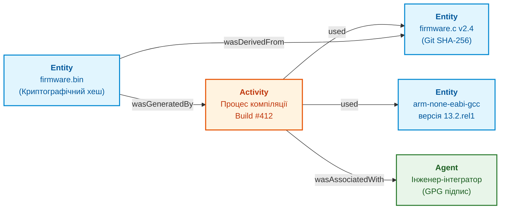

# Глава 3. Цифрова нитка та єдина модель даних інженерного підприємства

> **Книга:** [Керування складними інженерними проєктами та програмами](README.md) · [Частина I](part-01-foundations-and-systems-model.md)  
> **Попередня глава:** [Глава 2. Три горизонти: проєкт, програма, портфель і межі їхніх рішень](ch02-three-horizons-project-programme-portfolio.md)  
> **Наступна глава:** [Глава 4. WBS та гібридне планування: як узгодити залізо, прошивку, софт і сертифікацію](ch04-wbs-and-multi-cadence-delivery.md)  
> **Зміст книги:** [README.md](README.md)  
> **Автор:** [Микола Федчик](about-the-author.md)  
> **Рівень:** системні архітектори, інженери з системної інтеграції, керівники проєктів, фахівці з якості  
> **Очікувані результати:** проєктувати граф цифрової нитки для апаратно-програмного підприємства; будувати двоспрямовану простежуваність між вимогами, кодом, платами, тестами й сертифікаційними звітами; формалізувати алгоритми оцінки впливу інженерних змін; усувати ізольованість даних між PLM, ALM, EDA та ERP системами.

---

## Проблема розриву зв'язків: чому таблиці трасування не працюють

У класичній системній інженерії вимога простежуваності (*traceability*) відома десятиліттями: стандарт системної інженерії ISO/IEC/IEEE 15288 вимагає, щоб кожна вимога замовника була пов'язана з архітектурним рішенням, кодом або схемою, а також верифікована відповідним тестом [[1]](#src-1).

Проте на практиці більшість інженерних компаній ведуть простежуваність у вигляді статичних таблиць Excel чи Word (матриці трасування вимог, RTM). Коли проєкт налічує 2 000 вимог, 50 ревізій схем, 10 000 комітів у репозиторії та сотні закуплених комплектуючих, ручне оновлення такої таблиці стає неможливим. 

Виникає небезпечна ілюзія: таблиця існує як документ, але не відображає реального стану речей. Інженер замінив мікроконтролер, програміст оновив бібліотеку драйверів, а в таблиці вимог досі записані дані річної давнини. 

Щоб подолати цей розрив, сучасна інженерія переходить від пасивних текстових документів до **цифрової нитки (Digital Thread)**: активного, машинозчитуваного графа артефактів підприємства.

---

## Архітектура цифрової нитки як графа артефактів

Цифрова нитка є зв'язною інформаційною моделлю, яка фіксує походження, залежності й трансформації інженерних даних протягом усього життєвого циклу продукту [[2]](#src-2).

Замість зберігання всіх даних в одній монолітній системі, цифрова нитка працює як розподілена федеративна мережа. Кожен інструмент (система вимог, САПР електроніки, Git-репозиторій, CI/CD конвеєр, ERP-система) залишається джерелом правди для свого домену, але публікує стабільні ідентифікатори та семантичні зв'язки згідно з відкритими стандартами, такими як OSLC (*Open Services for Lifecycle Collaboration*) [[3]](#src-3).



Діаграма демонструє багатовимірність зв'язків. Вимога `REQ-SAFE-042` розподілена як на апаратну частину (номінал вимірювального шунта на платі `PCB-REV-C`), так і на мікропрограму (функція переривання `current_limit_isr()`). Тестовий сценарій `TC-HIL-108` перевіряє обидві реалізації одночасно.

Коли виникає дефект `DEF-402`, система управління миттєво знає:
1. які саме вимоги опинилися під загрозою невиконання;
2. які ревізії апаратури й гілки коду зачеплені проблемою;
3. який саме релізний шлюз (`REL-GATE-1.4`) блокується до усунення дефекту.

---

## Формалізація оцінки впливу змін (Impact Analysis)

Головна цінність графа цифрової нитки розкривається під час внесення інженерних змін. 

Нехай інженерне підприємство описується орієнтованим графом $\mathcal{G} = (\mathcal{V}, \mathcal{E})$, де $\mathcal{V}$ є множиною інженерних артефактів (вузлів), а $\mathcal{E}$ є множиною типізованих зв'язків (ребер) між ними. Кожен тип ребра має визначене правило поширення впливу $\delta$, яке вказує, у якому напрямку передається зміна: прямим напрямком ребра, зворотним або в обох напрямках.

Коли змінюється артефакт $`v^* \in \mathcal{V}`$ (наприклад, змінено текст вимоги, виправлено креслення або змінено мікросхему в схемі), множина артефактів, що підлягають повторній перевірці, формалізується як множина досяжності:

```math
\mathrm{Impact}(v^*)=\big\{\,u\in\mathcal{V}\ \big|\ v^{*}\leadsto_{\delta}u\,\big\}.
```

Позначення у виразі:

- $`\mathrm{Impact}(v^*)`$ є множиною всіх артефактів проєкту, на які впливає зміна артефакта $`v^*`$;
- $`v^* \in \mathcal{V}`$ є джерелом зміни (конкретний вузол графа: вимога, компонент, тест);
- $\mathcal{V}$ є повною множиною всіх зареєстрованих артефактів у цифровій нитці;
- $u \in \mathcal{V}$ є довільним артефактом, перевірюваним на досяжність;
- $`v^* \leadsto_{\delta} u`$ означає наявність орієнтованого шляху від початкового вузла $`v^*`$ до цільового вузла $u$ згідно з правилами поширення $\delta$.

Читається це так: аналіз впливу знаходить усі вузли, до яких веде шлях залежностей від зміненого елемента. 

Наприклад, якщо інженер змінює діапазон вимірювання напруги датчика у вимозі $`v^*`$, алгоритм за семантичними ребрами знаходить:
* електричну схему підсилювача ($u_1$);
* резистори дільника напруги в переліку BOM ($u_2$);
* константи калібрування в коді драйвера ADC ($u_3$);
* сценарій стендового тесту діапазону ($u_4$);
* пункт протоколу сертифікаційних випробувань ($u_5$).

Усі 5 знайдених артефактів автоматично отримують статус «Потребує перевірки» (*Suspect Link*). Жоден реліз не може бути сформований, доки інженери відповідних спеціальностей не підтвердять сумісність своїх артефактів із новою редакцією вимоги.

---

## Типологія зв'язків цифрової нитки

Щоб граф артефактів залишався обчислюваним, типи зв'язків між вузлами мають бути стандартизовані. Використання довільних текстових коментарів призводить до втрати строгості.

У сучасних інженерних системах використовують таку базову типологію ребер:

| Тип ребра | Зв'язувані сутності | Семантика відношення | Напрямок аналізу впливу |
| :--- | :--- | :--- | :--- |
| `satisfies` | Код / Плата $\to$ Вимога | Реалізація функціональності чи параметра | Від вимоги до коду й плати |
| `verifies` | Тест $\to$ Вимога | Перевірка виконання вимоги тестом | Від вимоги до тестового сценарію |
| `exercises` | Тест $\to$ Код / Плата | Фізичне виконання перевірки на об'єкті | Від коду чи плати до тесту |
| `specifies` | Вимога $\to$ Архітектура | Деталізація концепції підсистеми | Від концепції до вимог |
| `implements` | Збірка софту $\to$ Завдання | Виконання робочого завдання інженера | Від завдання до коміту |
| `blocks` | Дефект $\to$ Релізний шлюз | Заборона переходу через блокувальну помилку | Від дефекту до шлюзу |
| `supersedes` | Нова версія $\to$ Стара версія | Заміщення застарілого артефакта | Від старої версії до нової |

Така типологізація усуває неоднозначність: комп'ютерна програма може автоматично побудувати повний ланцюг простежуваності від польового дефекту до рядка коду та пункту міжнародного стандарту.

---

## Збереження походження: модель W3C PROV

У регуляторних галузях (авіація, залізниця, медицина, автотранспорт) аудитори вимагають довести не лише наявність зв'язку між артефактами, а й **достовірність його походження** (*provenance*): хто, коли, на основі якого інструменту та за якими вихідними даними створив кожен файл.

Міжнародний консорціум W3C розробив стандартизовану модель даних PROV (*PROV Data Model*), яка описує походження за допомогою трьох базових елементів і зв'язків між ними [[4]](#src-4):

1. **Сутності (Entities):** пасивні об'єкти даних (файл схеми, бінарний образ прошивки, звіт випробувань).
2. **Діяльності (Activities):** динамічні процеси перетворення даних (компіляція, калібрування стенду, автоматизований прогін тестів, засідання ради змін).
3. **Агенти (Agents):** суб'єкти, відповідальні за діяльність (інженер-розробник, верифікатор, автоматизований сервіс CI/CD).



Якщо під час експлуатації виробу виявлено збій, наявність графа походження PROV дозволяє миттєво відповісти на запитання:
* яка саме версія вихідного коду потрапила в цей бінарний образ;
* якою версією компілятора та з якими прапорцями оптимізації він зібраний;
* який інженер підписав збірку своїм криптографічним ключем;
* на якому саме апаратному стенді проводилися тести перед релізом.

Це виключає можливість підміни прошивки чи приховування невдалих тестів.

---

## Висновок

Цифрова нитка є головною передумовою керованості складного інженерного проєкту. Вона трансформує пасивну документацію на активний інформаційний граф, який автоматично відстежує взаємозв'язки між вимогами, схемами, кодом, випробуваннями та сертифікаційними звітами.

Замість витрачання місяців на ручне складання застарілих матриць трасування, інженерна організація отримує обчислювану модель системи. Ця модель дозволяє автоматизувати аналіз впливу змін, своєчасно виявляти приховані суперечності та забезпечувати надійне підтвердження походження кожного артефакта.

Цифрова нитка створює фундамент даних. Проте щоб за цими даними спланувати реальну роботу інженерних підрозділів, необхідна змістовна структура декомпозиції робіт.

Цій темі присвячена наступна частина книги, яку відкриває [Глава 4](ch04-wbs-and-multi-cadence-delivery.md) про побудову WBS та гібридне планування в умовах різнотемпової розробки.

---

## Питання для обговорення

1. Чому ведення матриць простежуваності (RTM) у форматі електронних таблиць Excel неминуче призводить до втрати актуальності даних у великому проєкті?
2. Яким чином концепція цифрової нитки дозволяє поєднати розрізнені інструменти (PLM, ALM, EDA, ERP) без необхідності створення єдиної монолітної бази даних?
3. Поясніть механізм роботи алгоритму аналізу впливу змін (Impact Analysis). Чому різні типи зв'язків у графі вимагають різного напрямку поширення залежності?
4. Що означає статус підозрілого зв'язку (*Suspect Link*), і яким чином він запобігає проникненню неперевірених змін у серійний випуск продукту?
5. Яку практичну роль відіграє стандарт W3C PROV під час проходження офіційного сертифікаційного аудиту надійності та безпеки виробу?

---

## Словник

- **Аналіз впливу змін (Impact Analysis):** формалізований процес визначення сукупності всіх вимог, компонентів, тестів та інших артефактів системи, які потребують перегляду чи повторної верифікації внаслідок модифікації вихідного елемента.
- **Двоспрямована простежуваність (Bidirectional Traceability):** здатність системи управління відстежувати ланцюг зв'язків як у прямому напрямку (від вимоги замовника до коду, схеми й тесту), так і у зворотному (від виявленого дефекту чи рядка коду до вихідної вимоги).
- **Матриця простежуваності вимог (RTM):** таблична форма відображення зв'язків між системними вимогами та артефактами їхньої реалізації й верифікації.
- **Підозрілий зв'язок (Suspect Link):** стан ребра в графі цифрової нитки, що сигналізує про модифікацію одного з пов'язаних артефактів та необхідність фахового підтвердження сумісності суміжного артефакта.
- **Походження даних (Provenance):** повний реєстр історичних фактів, дій, використаних інструментів та відповідальних осіб, що призвели до створення чи зміни конкретного інженерного артефакта.
- **Федеративна архітектура даних:** підхід до інтеграції систем, за якого кожне прикладне середовище зберігає власні дані, а зв'язки між ними підтримуються через стандартизовані відкриті протоколи та глобальні ідентифікатори (URI).
- **Цифрова нитка (Digital Thread):** машинно-простежуваний розподілений граф даних, що фіксує зв'язки між усіма артефактами інженерного виробу протягом повного життєвого циклу.

---

## Абревіатури

- **ALM** (*Application Lifecycle Management*): система управління життєвим циклом прикладного софту.
- **BOM** (*Bill of Materials*): перелік матеріалів і електронних компонентів виробу.
- **CAD** (*Computer-Aided Design*): система автоматизованого конструювання механічних вузлів.
- **EDA** (*Electronic Design Automation*): система автоматизації проєктування друкованих плат і мікросхем.
- **ERP** (*Enterprise Resource Planning*): система управління ресурсами, закупівлями й складами підприємства.
- **GPG** (*GNU Privacy Guard*): криптографічний інструмент для створення електронних цифрових підписів.
- **HIL** (*Hardware-in-the-Loop*): випробувальний комплекс із підключенням фізичного апаратного блоку до середовища моделювання.
- **JTAG** (*Joint Test Action Group*): апаратний інтерфейс для налагодження та прошивки мікроконтролерів.
- **OSLC** (*Open Services for Lifecycle Collaboration*): міжнародний відкритий стандарт інтеграції інструментів життєвого циклу розробки на базі веб-технологій.
- **PCB** (*Printed Circuit Board*): друкована плата для монтажу радіоелектронних компонентів.
- **PLM** (*Product Lifecycle Management*): система управління життєвим циклом виробу та його інженерними конфігураціями.
- **PRD** (*Product Requirements Document*): документ вимог до продукту.
- **PROV** (*Provenance Model*): стандарт W3C для представлення походження цифрових даних.
- **RTM** (*Requirements Traceability Matrix*): матриця простежуваності вимог.
- **SHA** (*Secure Hash Algorithm*): родина криптографічних алгоритмів обчислення незворотних геш-сум.
- **URI** (*Uniform Resource Identifier*): уніфікований ідентифікатор ресурсу в розподіленій інформаційній системі.

---

## Джерела

1. <a id="src-1"></a>ISO/IEC/IEEE. [*ISO/IEC/IEEE 15288: Systems and software engineering - System life cycle processes*](https://www.iso.org/standard/63711.html). ISO/IEC/IEEE, 2015.
2. <a id="src-2"></a>American Institute of Aeronautics and Astronautics. [*AIAA Digital Engineering Integration Committee: Digital Twin and Digital Thread Framework*](https://www.aiaa.org/). AIAA, 2020.
3. <a id="src-3"></a>OASIS Open. [*OSLC Core Specification Version 3.0*](https://open-services.net/specifications/). OASIS Standard, 2020.
4. <a id="src-4"></a>World Wide Web Consortium. [*PROV-DM: The PROV Data Model*](https://www.w3.org/TR/prov-dm/). W3C Recommendation, 2013.
5. <a id="src-5"></a>International Council on Systems Engineering. [*INCOSE Systems Engineering Handbook: A Guide for System Life Cycle Processes and Activities*](https://doi.org/10.1002/9781119516828), 4th Edition. Wiley, 2015.

---

[← До змісту книги](README.md) | [Частина I](part-01-foundations-and-systems-model.md) | [Глава 4 →](ch04-wbs-and-multi-cadence-delivery.md)
