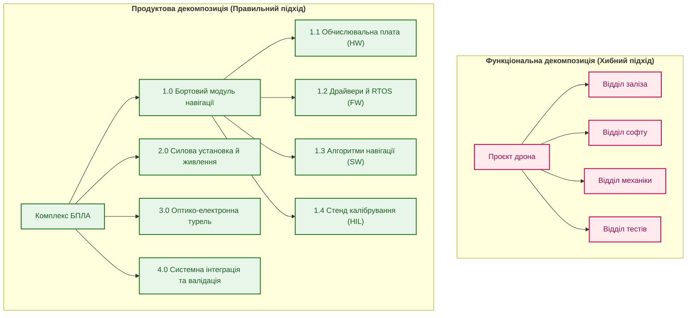
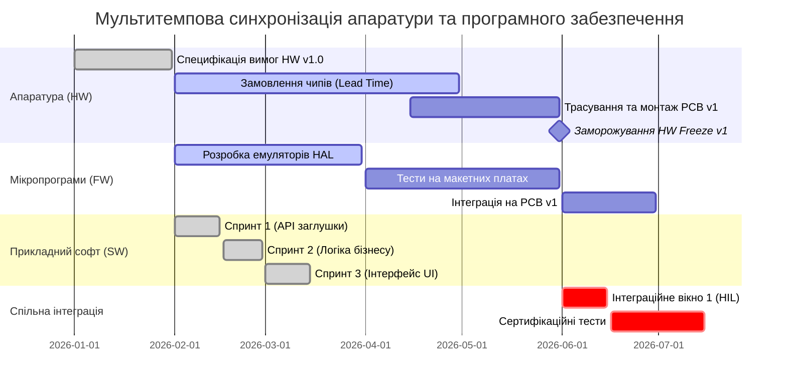

# Глава 4. WBS та гібридне планування: як узгодити залізо, прошивку, софт і сертифікацію

> **Книга:** [Керування складними інженерними проєктами та програмами](README.md) · [Частина II](part-02-planning-baselines-change-control.md)  
> **Попередня глава:** [Глава 3. Цифрова нитка та єдина модель даних інженерного підприємства](ch03-digital-thread-and-engineering-data-model.md)  
> **Наступна глава:** [Глава 5. Базові версії (Baselines) і рада контролю змін (CCB): механізм фіксації та узгодження](ch05-baselines-and-change-control-board.md)  
> **Зміст книги:** [README.md](README.md)  
> **Автор:** [Микола Федчик](about-the-author.md)  
> **Рівень:** проєктні менеджери, системні інженери, технічні керівники напрямів, фахівці PMO  
> **Очікувані результати:** створювати продуктово-орієнтовану структуру декомпозиції робіт (WBS); коректно інтегрувати різнорідні цикли розробки (апаратура, мікропрограми, софт, сертифікація); застосовувати правило 100 % для перевірки повноти розкладу; проєктувати вимірювані робочі пакети з єдиним відповідальним власником.

---

## Пастка функціональної декомпозиції

Під час старту нового інженерного проєкту керівники часто припускаються класичної помилки структурування робіт: вони створюють ієрархію WBS за організаційними підрозділами компанії.

У типовому плані з'являються гілки верхнього рівня:
1. «Роботи відділу схемотехніки»;
2. «Роботи відділу механіки»;
3. «Роботи відділу вбудованого програмного забезпечення»;
4. «Роботи відділу тестування».

Така декомпозиція виглядає зручною для керівників відділів, але є руйнівною для самого виробу. Вона закріплює організаційні бар'єри (силоси): кожен відділ прагне оптимізувати власну діяльність, ігноруючи системну інтеграцію. Відділ схемотехніки вважає свою задачу виконаною, коли схема накреслена, навіть якщо замовлені мікросхеми не сумісні з тепловим режимом корпусу, а програмісти не отримали опису регістрів.

Стандарт системної інженерії та настанова PMBOK однозначно стверджують: **WBS має бути орієнтована на результати (Deliverables), а не на дії чи підрозділи** [[1]](#src-1), [[2]](#src-2).

Верхній рівень WBS повинен відображати фізичну та логічну структуру продукту: бортовий обчислювальний комплекс, блок силового живлення, система технічного зору, наземна станція керування, стенд інтеграційного тестування. Тільки тоді кожен елемент декомпозиції має вимірювану матеріальну цінність.



---

## Правило 100 % та математична повнота декомпозиції

Головним правилом побудови надійної структури робіт є **правило 100 %**: WBS повинна охоплювати 100 % робіт, визначених обсягом проєкту, і не містити жодної зайвої роботи [[2]](#src-2).

Це правило застосовується на кожному рівні ієрархії: дочірні елементи будь-якого вузла в сумі повинні точно дорівнювати 100 % обсягу робіт свого батьківського елемента.

Нехай батьківський вузол декомпозиції $W_i$ містить запланований обсяг робіт (виражений у фінансовій вартості або трудовитратах). Якщо цей вузол розбито на $m$ взаємно виключних дочірніх пакетів робіт $`\{w_{i,1}, w_{i,2}, \dots, w_{i,m}\}`$, математична умова повноти та несуперечливості декомпозиції записується рівністю:

```math
W_i = \sum_{j=1}^{m} w_{i,j},
\qquad \forall j \neq k:\; w_{i,j} \cap w_{i,k} = \varnothing.
```

Позначення величин:

- $W_i$ є повним обсягом робіт батьківського елемента WBS;
- $m$ є кількістю дочірніх пакетів робіт, на які розбито батьківський елемент;
- $w_{i,j}$ є обсягом робіт $j$-го дочірнього пакета;
- $\sum_{j=1}^{m} w_{i,j}$ є сумою обсягів усіх дочірніх пакетів, що має точно покривати батьківський обсяг;
- $w_{i,j} \cap w_{i,k} = \varnothing$ вимагає відсутності перекриття: жодна робота не повинна дублюватися між різними пакетами робіт.

Практичний зміст цієї умови такий: якщо в сумі дочірніх робіт бракує хоча б одного елемента (наприклад, забули включити пакування, розробку кабельних джгутів або підготовку сертифікаційного формуляра), проєкт стикається з прихованими позабюджетними роботами. Якщо ж одна й та сама задача потрапила одночасно схемотехнікам і програмістам, виникає розпорошення відповідальності та подвійні витрати.

---

## Мультитемпова синхронізація: як узгодити різні цикли розробки

Найбільший практичний виклик в апаратно-програмних проєктах полягає в узгодженні підсистем із принципово різною тривалістю виробничого циклу.

Розглянемо часову шкалу створення складного приладу. Програмне забезпечення може розвиватися швидкими двотижневими ітераціями. Проте щоб протестувати новий функціонал у фізичному середовищі, програмістам необхідна фізична плата. Плата вимагає попереднього замовлення мікросхем із терміном доставки 16 тижнів і монтажу на фабриці протягом 3 тижнів.

Для подолання цього розриву застосовують **модель мультитемпової розробки (Multi-Cadence Delivery)** із фіксованими вікнами заморожування апаратури (*Hardware Freeze Windows*):



Діаграма ілюструє гібридний розклад:
1. **Апаратна лінія:** планується за класичними віхами з урахуванням ланцюгів постачання. Точка `Hardware Freeze v1` жорстко фіксує перелік інтерфейсів і геометрію плати. Після цієї дати внесення змін до схемотехніки поточної ревізії суворо заборонено.
2. **Програмна лінія:** рухається спринтами, але до фізичної готовності плати спирається на симулятори та макетні плати розробника (*Evaluation Boards*).
3. **Інтеграційне вікно (Integration Window):** заздалегідь зарезервований період у лабораторії, коли зібране залізо та стабільна гілка коду з'єднуються на випробувальному стенді HIL.

---

## Анатомія робочого пакета (Work Package)

Нижнім неподільним рівнем WBS є **робочий пакет (Work Package)**. Це одиниця роботи, яку можна однозначно призначити конкретному інженеру або невеликій групі, оцінити за тривалістю й бюджетом та об'єктивно верифікувати.

Типовою вадою інженерних планів є розмиті пакети робіт: наприклад, «Розробка алгоритму керування тривалістю 4 місяці». Такий запис унеможливлює контроль: через 3 місяці менеджер чує відповідь «Зроблено на 80 %», а в останній тиждень з'ясовується, що робота навіть не починалася на реальному обладнанні.

Професійний робочий пакет повинен задовольняти правилу 8/80: трудомісткість пакета має становити не менше 8 і не більше 80 людино-годин (від одного дня до двох тижнів роботи одного інженера). Якщо пакет більший за 80 годин, його слід декомпозувати на дрібніші частини.

Кожен робочий пакет у цифровій нитці проєкту повинен мати машинно-структурований паспорт:

```yaml
work_package:
  id: "WP-NAV-204"
  name: "Драйвер шини CAN для навігаційного мікроконтролера"
  owner: "Олександр Коваленко (Senior Embedded Engineer)"
  wbs_code: "1.1.3.2"
  duration_estimate_hours: 40
  inputs:
    - artifact_id: "SPEC-IC-CAN-TJA1051"
      version: "Rev 2.1"
    - artifact_id: "SCHEMATIC-NAV-MAIN"
      version: "v1.4"
  preconditions:
    - "Схемотехніка модуля навігації затверджена на CCB"
    - "Макетна плата мікроконтролера змонтована та доступна в лабораторії"
  outputs:
    - artifact_id: "SRC-FW-CAN-DRIVER"
      repository: "git@gitlab.corp/nav/firmware.git"
      branch: "feat/can-driver"
    - artifact_id: "DOC-CAN-TEST-REPORT"
  completion_criteria:
    - "Драйвер успішно проходить приймальні тести передавання 10 000 пакетів без помилок"
    - "Затримка обробки переривання не перевищує 50 мікросекунд"
    - "Код верифіковано статичним аналізатором MISRA C без критичних зауважень"
```

Такий опис усуває будь-яку двозначність: задача вважається закритою не тоді, коли інженер «втомився кодити», а тоді, коли об'єктивні критерії завершеності (*Completion Criteria*) підтверджені файлами звітів і тестовими прогонами.

---

## Висновок

Побудова продуктово-орієнтованої WBS є першим кроком до надійного інженерного планування. Вона усуває організаційні силоси між підрозділами, спрямовує увагу на фізичні підсистеми комплексу та забезпечує 100 % повноту врахування робіт.

Мультитемпова модель синхронізації дозволяє поєднати повільні виробничі цикли апаратного забезпечення зі швидкими ітераціями програмування через точки фіксації та інтеграційні вікна. Робочі пакети з чіткими критеріями завершеності перетворюють план із суб'єктивного розкладу на вимірюваний інженерний контракт.

Проте навіть ідеально складений план швидко руйнується без надійного механізму фіксації базових версій і контролю змін.

Цій темі присвячена наступна глава: [Глава 5. Базові версії (Baselines) і рада контролю змін (CCB)](ch05-baselines-and-change-control-board.md).

---

## Питання для обговорення

1. Чому функціональна декомпозиція WBS (за назвами інженерних відділів) неминуче призводить до конфліктів і розмивання відповідальності під час системної інтеграції?
2. Як правильно застосовувати правило 100 % під час структурування апаратно-програмного комплексу, і які приховані роботи найчастіше губляться під час планування?
3. Яким чином методологія мультитемпової розробки дозволяє зберегти гнучкість розробників софту, не зриваючи тривалих строків постачання апаратних мікросхем?
4. Що являє собою вікно заморожування заліза (Hardware Freeze), і чому порушення цієї межі призводить до каскадних зривів розкладу всієї програми?
5. Чому визначення чітких критеріїв завершеності (Completion Criteria) для кожного робочого пакета є більш надійним методом контролю, ніж оцінка «відсотка виконання» зі слів виконавця?

---

## Словник

- **Гібридне планування:** методологія організації проєкту, яка поєднує детерміноване планування довготривалих апаратних циклів за методом критичного шляху з ітеративною гнучкою розробкою програмного забезпечення.
- **Декомпозиція робіт:** послідовний розподіл повного обсягу проєкту на менші, більш керовані структурні частини та пакети завдань.
- **Заморожування апаратури (Hardware Freeze):** зафіксована календарна контрольна точка проєкту, після якої будь-які зміни в схемах, компонентах або конструкції поточної ревізії суворо заборонені.
- **Критерії завершеності (Completion Criteria):** перелік об'єктивних, машинно або експериментально перевірних вимог, виконання яких є обов'язковою умовою для закриття робочого пакета.
- **Мультитемпова розробка (Multi-Cadence Delivery):** узгоджене планування підсистем, що мають різну фізичну швидкість ітерацій (довгий цикл плат проти швидких спринтів коду).
- **Правило 100 %:** принцип системного планування, згідно з яким WBS повинна містити 100 % усіх необхідних робіт проєкту, а сума обсягів дочірніх пакетів повинна точно дорівнювати обсягу батьківського елемента без пропусків і дублювань.
- **Робочий пакет (Work Package):** найнижчий неподільний елемент WBS, який має визначену трудомісткість, бюджет, конкретного власника та вимірювані критерії приймання.
- **Структура виробу (Product Breakdown Structure, PBS):** ієрархічне представлення фізичних і функціональних компонентів, з яких складається готовий продукт.

---

## Абревіатури

- **ALM** (*Application Lifecycle Management*): система управління життєвим циклом програмного забезпечення.
- **BOM** (*Bill of Materials*): перелік деталей, мікросхем і матеріалів апаратного вузла.
- **CAD** (*Computer-Aided Design*): система автоматизованого проєктування механічних вузлів.
- **CAN** (*Controller Area Network*): стандарт надійної бортової мережі передавання даних у транспорті та автоматиці.
- **CCB** (*Change Control Board*): рада з контролю та затвердження інженерних змін.
- **EDA** (*Electronic Design Automation*): програмні комплекси проєктування друкованих плат і мікросхем.
- **ERP** (*Enterprise Resource Planning*): система планування виробничих ресурсів і матеріального обліку підприємства.
- **FW** (*Firmware*): вбудоване мікропрограмне забезпечення мікроконтролерів.
- **HIL** (*Hardware-in-the-Loop*): стендове випробування із включенням фізичної плати в цикл симулятора середовища.
- **HW** (*Hardware*): апаратне забезпечення, електронні плати та фізичні пристрої.
- **MISRA** (*Motor Industry Software Reliability Association*): міжнародний стандарт безпеки та надійності програмування мовою C у критичних системах.
- **PBS** (*Product Breakdown Structure*): ієрархічна структура матеріальних компонентів виробу.
- **PCB** (*Printed Circuit Board*): друкована плата для монтажу компонентів.
- **PLM** (*Product Lifecycle Management*): система управління даними про виріб на всіх стадіях його життя.
- **RTOS** (*Real-Time Operating System*): операційна система жорсткого реального часу.
- **SW** (*Software*): прикладне програмне забезпечення системи.
- **WBS** (*Work Breakdown Structure*): структура декомпозиції робіт проєкту.

---

## Джерела

1. <a id="src-1"></a>International Council on Systems Engineering. [*INCOSE Systems Engineering Handbook: A Guide for System Life Cycle Processes and Activities*](https://doi.org/10.1002/9781119516828), 4th Edition. Wiley, 2015.
2. <a id="src-2"></a>Project Management Institute. [*Practice Standard for Work Breakdown Structures*](https://www.pmi.org/pmbok-guide-standards/frameworks/practice-standard-wbs), 3rd Edition. PMI, 2019.
3. <a id="src-3"></a>Project Management Institute. [*A Guide to the Project Management Body of Knowledge (PMBOK Guide)*](https://www.pmi.org/pmbok-guide-standards/foundational/pmbok), 7th Edition. PMI, 2021.
4. <a id="src-4"></a>Harold Kerzner. [*Project Management: A Systems Approach to Planning, Scheduling, and Controlling*](https://www.wiley.com/en-us/Project+Management%3A+A+Systems+Approach+to+Planning%2C+Scheduling%2C+and+Controlling%2C+13th+Edition-p-9781119805373), 13th Edition. Wiley, 2022.
5. <a id="src-5"></a>MISRA. [*MISRA C:2023 Guidelines for the use of the C language in critical systems*](https://www.misra.org.uk/). HORIBA MIRA, 2023.

---

[← До Частини II](part-02-planning-baselines-change-control.md) | [До змісту книги](README.md) | [Глава 5 →](ch05-baselines-and-change-control-board.md)
