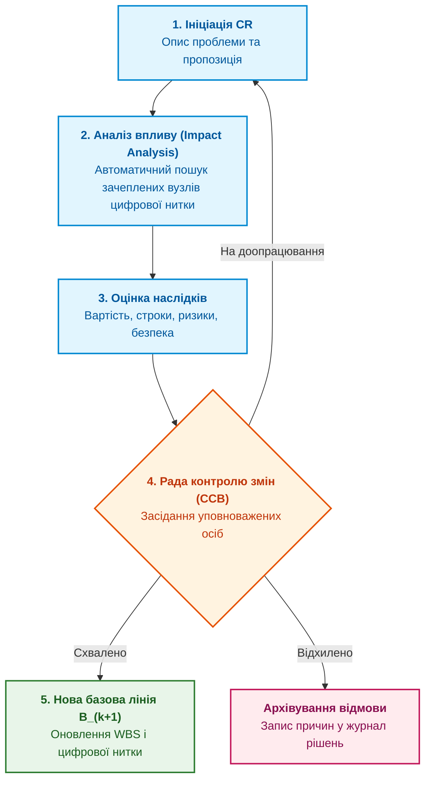

# Глава 5. Базові версії (Baselines) і рада контролю змін (CCB): механізм фіксації та узгодження

> **Книга:** [Керування складними інженерними проєктами та програмами](README.md) · [Частина II](part-02-planning-baselines-change-control.md)  
> **Попередня глава:** [Глава 4. WBS та гібридне планування: як узгодити залізо, прошивку, софт і сертифікацію](ch04-wbs-and-multi-cadence-delivery.md)  
> **Наступна глава:** [Глава 6. Міжпроєктні залежності та динамічний критичний шлях у програмі](ch06-cross-project-dependencies-and-critical-path.md)  
> **Зміст книги:** [README.md](README.md)  
> **Автор:** [Микола Федчик](about-the-author.md)  
> **Рівень:** проєктні менеджери, системні архітектори, інженери конфігураційного управління  
> **Очікувані результати:** розуміти роль базових версій як опорного стану інженерного виробу; організовувати роботу ради контролю змін (CCB); автоматизувати процес запиту на зміну (Change Request); запобігати неконтрольованому розповзанню меж проєкту (Scope Creep).

---

## Чому некеровані зміни руйнують інженерний проєкт

У процесі розробки складного виробу інженери постійно стикаються зі спокусою внести «дрібне поліпшення». Схемотехнік бачить перспективніший транзистор і змінює його на схемі; програміст вирішує оптимізувати протокол обміну; конструктор зменшує товщину стінки корпусу для полегшення виробу. Окремо кожна така ініціатива продиктована добрими намірами. Проте в сукупності некеровані зміни породжують явище розповзання меж проєкту (*Scope Creep*) та розсинхронізацію команд.

Коли схемотехнік замінив транзистор без формального узгодження, прошивка виявляється налаштованою на інші часові затримки перемикання, а закупівлі вже оплатили партію попередніх деталей. 

Щоб запобігти цьому хаосу, системна інженерія спирається на інститут **базових ліній (Baselines)** та **раду контролю змін (Change Control Board, CCB)** [[1]](#src-1).

---

## Формальна модель базової лінії

Базова лінія є офіційно узгодженим і зафіксованим знімком конфігурації проєкту, який слугує відправною точкою для подальшої роботи й може змінюватися виключно через регламентовану процедуру [[2]](#src-2).

Базову версію інженерного проєкту $\mathcal{B}_k$ формально описують кортежем чотирьох взаємопов'язаних вимірів:

```math
\mathcal{B}_k = (R_k, A_k, S_k, C_k).
```

Позначення:

- $\mathcal{B}_k$ є базовою лінією проєкту версії $k$;
- $R_k$ є множиною затверджених вимог (*Requirements*) на момент фіксації;
- $A_k$ є архітектурною специфікацією виробу (*Architecture*), що включає креслення, схеми й інтерфейси;
- $S_k$ є затвердженим календарним розкладом робіт (*Schedule*);
- $C_k$ є кошторисом і бюджетом витрат (*Cost*).

Зміна будь-якого елемента кортежу порушує баланс системи. Неможливо додати нові вимоги ($\Delta R$), не змінивши розклад ($\Delta S$) або бюджет ($\Delta C$). Будь-яка модифікація вимагає переходу до нової узгодженої версії:

```math
\mathcal{B}_{k+1} = \mathrm{Apply}(\mathcal{B}_k, \Delta),
\qquad \Delta = (\Delta R, \Delta A, \Delta S, \Delta C).
```

Складники формули:

- $\mathcal{B}_{k+1}$ є новою затвердженою базовою лінією проєкту;
- $\mathrm{Apply}$ є формальною процедурою застосування схваленої зміни;
- $\Delta$ є повним пакетом змін, де кожен елемент враховує технічні, розкладні та фінансові наслідки.

Якщо зміна не пройшла затвердження, проєктний простір залишається в стані $\mathcal{B}_k$, а будь-які неавторизовані правки в коді чи залізі вважаються дефектом конфігурації.

---

## Життєвий цикл запиту на зміну (Change Request)

Процес розгляду технічних і організаційних змін має бути швидким, прозорим і машинно-перевірним:



Етапи проходження запиту на зміну:
1. **Ініціація запиту:** будь-який інженер, тестувальник або замовник формує картку CR із зазначенням технічної проблеми.
2. **Аналіз впливу через цифрову нитку:** алгоритм графа артефактів автоматично визначає, які схеми, блоки коду, тести та закупівельні замовлення зачіпає ця пропозиція.
3. **Оцінка наслідків:** профільні лідери оцінюють зміну вартості ($\Delta C$) та затримку строків ($\Delta S$).
4. **Рішення ради CCB:** колегіальний розгляд на засіданні за участі представників усіх зацікавлених сторін.
5. **Фіксація нової базової лінії:** публікація маніфесту версії $\mathcal{B}_{k+1}$ з автоматичним оновленням робочих пакетів WBS.

---

## Склад і регламент ради контролю змін (CCB)

Рада з контролю змін не є бюрократичним комітетом, що гальмує роботу. Це робочий інструмент захисту проєкту від внутрішніх суперечностей.

Обов'язковий склад CCB для апаратно-програмного комплексу:
* **Керівник проєкту / Голова ради:** ухвалює фінальне рішення за наявності розбіжностей;
* **Головний системний архітектор:** перевіряє сумісність зміни з системною концепцією виробу;
* **Лідер апаратного напряму (Hardware Lead):** оцінює вплив на схемотехніку, теплові режими, плати й перелік BOM;
* **Лідер програмного напряму (Software Lead):** оцінює вплив на архітектуру мікропрограм, API та продуктивність;
* **Інженер із верифікації та якості:** визначає обсяг повторного тестування (регресії);
* **Представник виробництва й закупівель:** оцінює наявність компонентів на ринку та залишкові складські запаси.

Засідання проводяться за фіксованим розкладом (наприклад, щовівторка о 10:00) і розглядають лише попередньо проаналізовані запити. Для критичних безпекових змін обов'язковим є кворум із правом вето системного архітектора та інженера з безпеки.

---

## Висновок

Базові версії та рада контролю змін створюють стабільний каркас інженерної розробки. Вони дають командам упевненість у тому, що інтерфейси підсистем не зміняться раптово за спиною розробників.

Перехід від паперового узгодження до автоматизованого аналізу впливу через цифрову нитку скорочує тривалість розгляду змін з тижнів до годин.

Коли базові лінії зафіксовані, наступним завданням стає математичний аналіз зв'язків між роботами. Цьому присвячена наступна глава: [Глава 6. Міжпроєктні залежності та динамічний критичний шлях у програмі](ch06-cross-project-dependencies-and-critical-path.md).

---

## Питання для обговорення

1. Чому наявність базової версії вимог і схем є обов'язковою передумовою для об'єктивної оцінки строків і бюджету проєкту?
2. Які негативні наслідки для проєкту виникають тоді, коли інженери вносять локальні технічні покращення без реєстрації запиту на зміну?
3. Як граф цифрової нитки прискорює роботу ради контролю змін (CCB) під час виконання аналізу впливу?
4. Чому представник відділу закупівель і виробництва повинен входити до складу CCB в апаратно-програмних розробках?
5. У яких випадках запит на зміну повинен відхилятися, навіть якщо він технічно покращує окремий параметр виробу?

---

## Словник

- **Базова версія (Baseline):** зафіксований стан вимог, архітектури, розкладу та бюджету, який слугує еталоном для порівняння й контролю.
- **Запит на зміну (Change Request, CR):** формальний документ або цифровий запис із пропозицією модифікації затвердженої базової лінії.
- **Кворум CCB:** мінімально необхідний склад уповноважених фахівців ради змін, без присутності яких рішення не набуває чинності.
- **Неповоротні витрати (Sunk Costs):** кошти та час, уже витрачені на проєкт, які неможливо повернути, і які не повинні впливати на раціональне рішення щодо майбутніх змін.
- **Рада контролю змін (Change Control Board, CCB):** колегіальний орган проєкту, уповноважений оцінювати, погоджувати або відхиляти запити на зміну базових ліній.
- **Розповзання меж (Scope Creep):** неконтрольоване накопичення нових функцій і змін у проєкті без відповідного коригування строків і бюджету.

---

## Абревіатури

- **API** (*Application Programming Interface*): інтерфейс прикладного програмування.
- **BOM** (*Bill of Materials*): специфікація компонентів і матеріалів.
- **CCB** (*Change Control Board*): рада з контролю змін проєкту.
- **CR** (*Change Request*): запит на внесення технічної або планової зміни.
- **HIL** (*Hardware-in-the-Loop*): стендове випробування апаратури з моделюванням середовища.
- **HW** (*Hardware*): апаратні електронні засоби.
- **MISRA** (*Motor Industry Software Reliability Association*): стандарти надійного кодування мовою C.
- **PCB** (*Printed Circuit Board*): друкована плата електронного модуля.
- **RTOS** (*Real-Time Operating System*): операційна система реального часу.
- **WBS** (*Work Breakdown Structure*): структура декомпозиції робіт.

---

## Джерела

1. <a id="src-1"></a>International Council on Systems Engineering. [*INCOSE Systems Engineering Handbook: A Guide for System Life Cycle Processes and Activities*](https://doi.org/10.1002/9781119516828), 4th Edition. Wiley, 2015.
2. <a id="src-2"></a>Project Management Institute. [*A Guide to the Project Management Body of Knowledge (PMBOK Guide)*](https://www.pmi.org/pmbok-guide-standards/foundational/pmbok), 7th Edition. PMI, 2021.
3. <a id="src-3"></a>EIA. [*ANSI/EIA-649-C: National Consensus Standard for Configuration Management*](https://www.sae.org/standards/content/eia649c/). SAE International, 2019.

---

[← До Частини II](part-02-planning-baselines-change-control.md) | [До змісту книги](README.md) | [Глава 6 →](ch06-cross-project-dependencies-and-critical-path.md)
