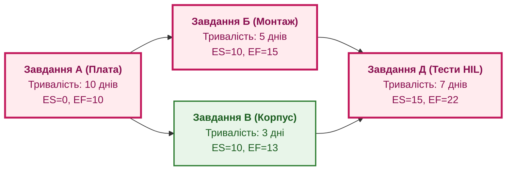

# Глава 6. Міжпроєктні залежності та динамічний критичний шлях у програмі

> **Книга:** [Керування складними інженерними проєктами та програмами](README.md) · [Частина II](part-02-planning-baselines-change-control.md)  
> **Попередня глава:** [Глава 5. Базові версії (Baselines) і рада контролю змін (CCB): механізм фіксації та узгодження](ch05-baselines-and-change-control-board.md)  
> **Наступна глава:** [Глава 7. Метрики для дії, а не для звітів: потік, незавершене виробництво та закони черг](ch07-actionable-metrics-vs-report-theatre.md)  
> **Зміст книги:** [README.md](README.md)  
> **Автор:** [Микола Федчик](about-the-author.md)  
> **Рівень:** програмні менеджери, інженери-планувальники, керівники складних проєктів, фахівці PMO  
> **Очікувані результати:** володіти математичним апаратом методу критичного шляху (CPM) на графах робіт; розраховувати ранні й пізні терміни та повний резерв часу; будувати й аналізувати матриці структури залежностей (DSM); виявляти приховані ресурсні блокери між проєктами програми.

---

## Проблема прихованих міжпроєктних зв'язків

У складній інженерній програмі затримка рідко виникає всередині одного ізольованого завдання. Найчастіше зрив дедлайну спричиняють неочевидні залежності на стиках між проєктами:

* команда радіолінії затримує випуск модуля передавача на 4 дні;
* це зміщує початок калібрування антени на єдиному в компанії випробувальному стенді;
* через це команда навігації втрачає своє вікно в безлунній камері й змушена чекати 3 тижні наступного слота;
* затримка навігації блокує польотні випробування всього комплексу.

Окремо кожна затримка здавалася незначною, але через жорсткі ресурсні зв'язки вона викликала каскадний ефект доміно.

Щоб контролювати таку систему, програмний менеджер повинен спиратися на математичний апарат теорії графів: **метод критичного шляху (Critical Path Method, CPM)** та **матриці структури залежностей (Dependency Structure Matrix, DSM)** [[1]](#src-1), [[2]](#src-2).

---

## Математичний апарат методу критичного шляху (CPM)

Мережевий графік програми моделюють у вигляді орієнтованого ациклічного графа $\mathcal{G} = (\mathcal{V}, \mathcal{E})$, де вузли $\mathcal{V}$ відповідають робочим пакетам, а ребра $\mathcal{E}$ задають технологічні зв'язки передування.

Кожне завдання $i \in \mathcal{V}$ має тривалість $D_i \ge 0$.



Розрахунок розкладу складається з двох проходів:

### 1. Прямий прохід (Forward Pass)
Визначає найбільш ранній можливий час початку ($ES$) і завершення ($EF$) кожного завдання:

```math
ES_i = \max_{p \in \mathrm{Pred}(i)} EF_p,
\qquad EF_i = ES_i + D_i,
\qquad ES_{	ext{start}} = 0.
```

### 2. Зворотний прохід (Backward Pass)
Визначає найпізніший допустимий час початку ($LS$) і завершення ($LF$), за якого загальний строк програми не збільшується:

```math
LF_i = \min_{s \in \mathrm{Succ}(i)} LS_s,
\qquad LS_i = LF_i - D_i,
\qquad LF_{	ext{end}} = EF_{	ext{end}}.
```

### 3. Повний резерв часу (Total Float)
Різниця між пізніми й ранніми термінами визначає гнучкість розкладу для завдання $i$:

```math
TF_i = LS_i - ES_i = LF_i - EF_i.
```

Позначення у формулі:

- $TF_i$ є повним резервом часу (*Total Float*) завдання $i$, виміряним у днях або годинах;
- $LS_i$ є найпізнішим допустимим стартом завдання без зриву загального дедлайну;
- $ES_i$ є найранішим можливим стартом завдання за готовності всіх попередників;
- $LF_i$ та $EF_i$ є відповідними пізніми й ранніми термінами завершення.

**Критичний шлях (Critical Path):** послідовність завдань від початку до кінця проєкту з нульовим резервом часу:

$$TF_i = 0.$$

Будь-яка затримка на критичному шляху безпосередньо збільшує тривалість усієї інженерної програми.

У прикладі на діаграмі:
* Шлях А $	o$ Б $	o$ Д має тривалість $10 + 5 + 7 = 22$ дні ($TF = 0$, це критичний шлях).
* Завдання В має $ES = 10, EF = 13$, але $LF = 15, LS = 12$. Його резерв $TF = 12 - 10 = 2$ дні. Затримка виготовлення корпусу на 2 дні не змістить дату фінальних тестів.

---

## Матриця структури залежностей (DSM)

Коли кількість завдань у програмі перевищує сотні, орієнтований граф стає надто громіздким для аналізу. Для компактного подання застосовують **матрицю структури залежностей (Dependency Structure Matrix, DSM)** [[2]](#src-2).

DSM є квадратною матрицею, рядки й стовпці якої відповідають завданням або модулям системи в однаковому порядку:

```text
       |  A  |  B  |  C  |  D  |
   ----+-----+-----+-----+-----+
   A   |  .  |     |     |     |
   B   |  X  |  .  |     |     |
   C   |  X  |     |  .  |     |
   D   |     |  X  |  X  |  .  |
```

Символ `X` на перетині рядка $i$ і стовпця $j$ означає, що завдання $i$ залежить від результатів завдання $j$.

Головні переваги DSM:
1. **Виявлення циклічних залежностей:** якщо позначка `X` з'являється вище головної діагоналі, у системі існує зворотний зв'язок або цикл очікування (завдання А чекає на Б, а Б чекає на А). Це сигнал архітектурного глухого кута.
2. **Алгоритми кластеризації:** перестановка рядків і стовпців матриці дозволяє згрупувати тісно пов'язані роботи в межах одного підпроєкту, мінімізуючи складні зовнішні зв'язки.

---

## Висновок

Аналіз міжпроєктних залежностей і критичного шляху перетворює інтуїтивне календарне планування на точну інженерну дисципліну. Він дає програмному менеджеру об'єктивний критерій фокусування уваги: ресурси слід інвестувати насамперед у завдання з нульовим резервом часу.

Матриці DSM допомагають проєктувати організаційну структуру програми так, щоб усувати шкідливі циклічні залежності між командами.

Проте навіть точний розклад є лише теоретичною моделлю, доки організація не навчиться вимірювати фактичний потік робіт. Наступна частина книги присвячена подійно-орієнтованому управлінню та дієвим метрикам.

Відкриває її [Глава 7. Метрики для дії, а не для звітів: потік, незавершене виробництво та закони черг](ch07-actionable-metrics-vs-report-theatre.md).

---

## Питання для обговорення

1. Чому незначна локальна затримка в некритичному на перший погляд завданні може викликати каскадний зрив загального дедлайну програми?
2. Яким чином прямий і зворотний проходи алгоритму CPM дозволяють обчислити повний резерв часу (Total Float) для кожного завдання?
3. Чому зміщення уваги менеджера на завдання з великим резервом часу є типовою управлінською помилкою?
4. Як матриця структури залежностей (DSM) допомагає системному архітектору виявити шкідливі цикли очікування між підсистемами?
5. Як динамічно змінюється критичний шлях у процесі виконання інженерної програми, якщо фактичні строки робіт відхиляються від планових?

---

## Словник

- **Динамічний критичний шлях:** послідовність критичних завдань у проєктному графі, склад якої може змінюватися в реальному часі внаслідок фактичних затримок або випереджень робіт.
- **Зворотний зв'язок у плануванні:** циклічна залежність між задачами, за якої жодна з робіт не може бути завершена без результатів іншої.
- **Матриця структури залежностей (DSM):** компактний квадратний матричний спосіб подання зв'язків між елементами системи або завданнями для аналізу структури й кластеризації.
- **Метод критичного шляху (CPM):** детермінований алгоритм розрахунку тривалості проєкту на основі знаходження найдовшого безперервного ланцюга залежних робіт.
- **Повний резерв часу (Total Float):** період, на який виконання завдання може бути затримане без зміщення кінцевого терміну завершення всього проєкту.
- **Ранній старт (Early Start):** найраніший календарний момент, коли завдання може розпочатися за умови завершення всіх робіт-попередників.

---

## Абревіатури

- **CPM** (*Critical Path Method*): метод критичного шляху в плануванні мережевих графіків.
- **DSM** (*Dependency Structure Matrix*): матриця структури залежностей.
- **EF** (*Early Finish*): ранній фініш завдання.
- **ES** (*Early Start*): ранній старт завдання.
- **HIL** (*Hardware-in-the-Loop*): випробувальний стенд із підключенням апаратного модуля до симулятора.
- **LF** (*Late Finish*): пізній фініш завдання.
- **LS** (*Late Start*): пізній старт завдання.
- **PERT** (*Program Evaluation and Review Technique*): техніка оцінювання та аналізу програм за трьома оцінками.
- **TF** (*Total Float*): повний резерв часу завдання.
- **WBS** (*Work Breakdown Structure*): структура декомпозиції робіт.

---

## Джерела

1. <a id="src-1"></a>James E. Kelley, Morgan R. Walker. [*Critical-Path Planning and Scheduling*](https://doi.org/10.1145/1460299.1460318). Proceedings of the Eastern Joint Computer Conference, 1959.
2. <a id="src-2"></a>Tyson R. Browning. [*Applying the Dependency Structure Matrix to System Engineering and Project Management*](https://doi.org/10.1002/sys.4360040404). Systems Engineering, 4(4):291–306, 2001.
3. <a id="src-3"></a>Project Management Institute. [*Practice Standard for Scheduling*](https://www.pmi.org/pmbok-guide-standards/frameworks/practice-standard-scheduling), 3rd Edition. PMI, 2019.

---

[← До Частини II](part-02-planning-baselines-change-control.md) | [До змісту книги](README.md) | [Глава 7 →](ch07-actionable-metrics-vs-report-theatre.md)
