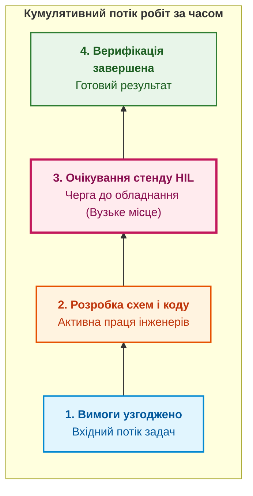

# Глава 7. Метрики для дії, а не для звітів: потік, незавершене виробництво та закони черг

> **Книга:** [Керування складними інженерними проєктами та програмами](README.md) · [Частина III](part-03-event-driven-management-metrics.md)  
> **Попередня глава:** [Глава 6. Міжпроєктні залежності та динамічний критичний шлях у програмі](ch06-cross-project-dependencies-and-critical-path.md)  
> **Наступна глава:** [Глава 8. Подійно-орієнтоване управління: як інженерні сигнали запускають управлінські реакції](ch08-event-driven-management-and-telemetry.md)  
> **Зміст книги:** [README.md](README.md)  
> **Автор:** [Микола Федчик](about-the-author.md)  
> **Рівень:** проєктні лідери, операційні директори, керівники PMO, Scrum-майстри інженерних команд  
> **Очікувані результати:** усувати марні декоративні звіти; розраховувати й контролювати час циклу та час випередження за законом Літтла; аналізувати діаграми кумулятивного потоку (CFD); обчислювати ефективність потоку робіт та встановлювати раціональні ліміти WIP.

---

## Ілюзія звітного театру

У багатьох інженерних компаніях щотижневий звіт про стан робіт перетворюється на ритуал. Керівники витрачають четвер і п'ятницю на розфарбовування кружечків у презентаціях PowerPoint: зелений («усе гаразд»), жовтий («є певні затримки») та червоний («критична проблема»).

Така система індикації страждає на три хронічні вади:
1. **Суб'єктивність:** статус визначається не об'єктивними даними приладів і репозиторіїв, а психологічним станом менеджера та його бажанням не засмучувати вище керівництво.
2. **Запізнілість:** статус «червоний» виставляється за кілька днів до провалу дедлайну, коли змінити щось без колосальних надурочних витрат уже неможливо.
3. **Бездіяльність:** факт фіксації жовтого чи червоного статусу сам по собі не вказує на конкретну технічну причину й не породжує дії.

Щоб метрика мала сенс, вона повинна мати власника, джерело перевірених даних і автоматичний операційний наслідок. Якщо значення метрики перевищує встановлений поріг, система управління повинна автоматично запускати регламент реакції: перерозподіл інженерів, зупинку прийому нових задач або скликання екстреного засідання ради змін.

---

## Закон Літтла та математика незавершеного виробництва (WIP)

Головною причиною хронічних затримок у розробці є не брак талановитих інженерів, а перевантаження виробничої системи надмірною кількістю одночасно розпочатих робіт (*Work In Progress, WIP*).

У теорії масового обслуговування базовим є **закон Літтла**, сформульований Джоном Літтлом 1961 року [[1]](#src-1). Для стаціонарної системи в сталому стані середня кількість вимог у системі дорівнює добутку середнього темпу надходження на середній час перебування:

```math
L = \lambda W.
```

Позначення:

- $L$ є середньою кількістю завдань або деталей, що одночасно перебувають у роботі (обсяг незавершеного виробництва, WIP);
- $\lambda$ є пропускною здатністю системи (*Throughput*, $TH$), тобто середньою кількістю завершених робіт за одиницю часу (наприклад, задач на тиждень);
- $W$ є середнім часом перебування завдання в системі від початку до завершення (час циклу, *Cycle Time*, $CT$).

У термінах проєктного менеджменту закон записують так:

```math
CT = \frac{WIP}{TH}.
```

Складники формули:

- $CT$ є часом циклу розробки завдання (в днях або тижнях);
- $WIP$ є кількістю паралельно відкритих робочих пакетів;
- $TH$ є реальною продуктивністю інженерної групи (кількість пакетів, яку команда здатна якісно протестувати й здати за одиницю часу).

Практичний висновок із закону Літтла безжальний: **якщо команда намагається робити вдвічі більше завдань одночасно за незмінної продуктивності, середній час очікування кожного завдання зростає рівно вдвічі**.

Нехай інженерний відділ здатний випускати $TH = 5$ протестованих модулів на місяць. Якщо керівництво відкриває одночасно 20 модулів ($WIP = 20$), середній час готовності модуля становить:

$$CT = \frac{20}{5} = 4 \text{ місяці}.$$

Якщо ж штучно обмежити кількість робіт до 5 ($WIP = 5$), час циклу скорочується до:

$$CT = \frac{5}{5} = 1 \text{ місяць}.$$

Швидкість виходу результату на ринок зростає вчетверо без найму додаткового персоналу, виключно шляхом ліквідації черг і простоїв.

---

## Ефективність потоку (Flow Efficiency)

У процесі створення апаратно-програмного виробу більшість часу робочий пакет проводить не в руках інженера, а в очікуванні: очікуванні затвердження схеми, очікуванні закупівлі резисторів, очікуванні звільнення стенду калібрування.

Співвідношення корисного часу до загального часу очікування вимірює **ефективність потоку (Flow Efficiency)**:

```math
\eta_{\text{flow}} = \frac{T_{\text{touch}}}{T_{\text{lead}}} \times 100\,\%.
```

Позначення у виразі:

- $\eta_{\text{flow}}$ є ефективністю потоку робіт, вираженою у відсотках;
- $T_{\text{touch}}$ є сумарним часом активної інженерної праці над артефактом (*Touch Time* або *Active Work Time*), у годинах;
- $T_{\text{lead}}$ є повним календарним часом від моменту створення заявки до отримання верифікованого результату (*Lead Time*), у годинах.

У традиційних інженерних організаціях ефективність потоку часто становить менше 5 %–10 %. Це означає, що 90 % часу виріб просто лежить на складі або в черзі трекера. Спроби змусити інженерів працювати швидше дають копійчаний виграш. Справжній резерв прискорення розробки полягає в ліквідації 90 % мертвого часу очікування.

---

## Діаграма кумулятивного потоку (CFD)

Найкращим інструментом візуалізації потоку робіт є **діаграма кумулятивного потоку (Cumulative Flow Diagram, CFD)** [[2]](#src-2):



Як читати CFD:
* **Вертикальна відстань між межами смуги:** показує обсяг незавершеного виробництва (WIP) на відповідному етапі в цей день.
* **Горизонтальна відстань між вхідною та вихідною лініями:** показує фактичний час випередження (Lead Time) для задачі.
* **Розширення середньої смуги:** свідчить про утворення затору (вузького місця). Якщо смуга «Очікування стенду HIL» стрімко розширюється, це прямий сигнал керівництву: необхідно збільшити кількість стендів або змінити розклад їхнього використання.

---

## Висновок

Відмова від декоративного розфарбовування статус-звітів на користь метрик потоку переводить інженерний менеджмент на об'єктивні засади теорії черг.

Закон Літтла доводить, що скорочення строків розробки досягається не надурочною працею інженерів, а жорстким обмеженням одночасно виконуваних завдань. Діаграма кумулятивного потоку наочно показує затори в процесі до того, як вони призведуть до зриву дедлайну.

Щоб розраховувати ці метрики без затримок і людського фактора, система управління повинна отримувати сигнали безпосередньо з робочих інструментів.

Цій темі присвячена [Глава 8. Подійно-орієнтоване управління: як інженерні сигнали запускають управлінські реакції](ch08-event-driven-management-and-telemetry.md).

---

## Питання для обговорення

1. У чому полягає принципова різниця між інформацією для формального звіту та метрикою, призначеною для прийняття негайного рішення?
2. Яким чином закон Літтла пояснює явище різкого зростання строків розробки при спробі одночасно виконувати занадто багато проєктів?
3. Чому показник ефективності потоку (Flow Efficiency) у більшості інженерних підприємств рідко перевищує 10 %, і де ховаються інші 90 % часу?
4. Які характерні геометричні патерни на діаграмі кумулятивного потоку (CFD) вказують на появу прихованого вузького місця в лабораторії випробувань?
5. Які правила обмеження незавершеного виробництва (WIP Limits) доцільно встановити для відділу розробки друкованих плат і мікропрограм?

---

## Словник

- **Діаграма кумулятивного потоку (CFD):** графічний інструмент візуалізації динаміки завдань на різних стадіях розробки протягом часу, що показує обсяг WIP і Lead Time.
- **Ефективність потоку (Flow Efficiency):** відношення часу активної безпосередньої роботи над задачею до повного календарного часу від її ініціації до завершення.
- **Закон Літтла:** теорема теорії масового обслуговування, яка пов'язує середню кількість завдань у системі з їхнім середнім часом циклу та пропускною здатністю.
- **Ліміт WIP (WIP Limit):** адміністративне чи програмне обмеження на максимальну кількість завдань, що можуть одночасно перебувати в певній колонці або на певному робочому етапі.
- **Незавершене виробництво (Work In Progress, WIP):** загальна кількість робочих пакетів або артефактів, робота над якими вже розпочалася, але ще не завершена приймальними випробуваннями.
- **Пропускна здатність (Throughput):** кількість одиниць цінності або робочих пакетів, що повністю завершуються системою за одиницю часу.
- **Час випередження (Lead Time):** повний календарний інтервал від моменту фіксації потреби чи запиту до передавання готового результату споживачеві.
- **Час циклу (Cycle Time):** період часу, протягом якого над робочим пакетом безпосередньо виконувалися інженерні чи виробничі операції.

---

## Абревіатури

- **CFD** (*Cumulative Flow Diagram*): діаграма кумулятивного потоку робіт.
- **CT** (*Cycle Time*): час циклу виконання завдання.
- **HIL** (*Hardware-in-the-Loop*): стенд випробувань реального апаратного модуля.
- **LT** (*Lead Time*): повний час випередження поставки.
- **PMO** (*Project Management Office*): офіс управління проєктами.
- **TH** (*Throughput*): пропускна здатність виробничої системи.
- **WIP** (*Work In Progress*): незавершене виробництво.

---

## Джерела

1. <a id="src-1"></a>John D. C. Little. [*A Proof for the Queuing Formula: L = λW*](https://doi.org/10.1287/opre.9.3.383). Operations Research, 9(3):383–387, 1961.
2. <a id="src-2"></a>David J. Anderson. [*Kanban: Successful Evolutionary Change for Your Technology Business*](https://djaa.com/kanban-successful-evolutionary-change-for-your-technology-business/). Blue Hole Press, 2010.
3. <a id="src-3"></a>Eliyahu M. Goldratt. [*The Goal: A Process of Ongoing Improvement*](https://www.goldrattbooks.com/). North River Press, 1984.

---

[← До Частини III](part-03-event-driven-management-metrics.md) | [До змісту книги](README.md) | [Глава 8 →](ch08-event-driven-management-and-telemetry.md)
