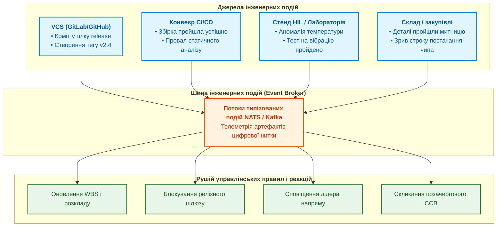

# Глава 8. Подійно-орієнтоване управління: як інженерні сигнали запускають управлінські реакції

> **Книга:** [Керування складними інженерними проєктами та програмами](README.md) · [Частина III](part-03-event-driven-management-metrics.md)  
> **Попередня глава:** [Глава 7. Метрики для дії, а не для звітів: потік, незавершене виробництво та закони черг](ch07-actionable-metrics-vs-report-theatre.md)  
> **Наступна глава:** [Глава 9. Освоєний обсяг (EVM) та ймовірнісний прогноз строків за методом Монте-Карло](ch09-earned-value-and-probabilistic-forecasting.md)  
> **Зміст книги:** [README.md](README.md)  
> **Автор:** [Микола Федчик](about-the-author.md)  
> **Рівень:** технічні директори, керівники PMO, DevOps/SysOps архітектори, інженери автоматизації процесів  
> **Очікувані результати:** проєктувати брокер подій для управління інженерним проєктом; автоматизувати збір телеметрії з репозиторіїв, систем збирання, випробувальних стендів та ERP; будувати ланцюги швидкої реакції на інженерні інциденти; ліквідувати ручні опитування інженерів про статус завдань.

---

## Чому опитування людей про статус є застарілою практикою

У багатьох інженерних організаціях робочий день менеджера складається з нескінченних запитань у месенджерах: «Який статус по платі?», «Чи зібралася прошивка?», «Чи надійшли мікросхеми на склад?», «Чи пройшов тест у кліматичній камері?».

Цей підхід має дві системні вади:
1. **Відволікання інженерів:** постійні смикання руйнують концентрацію технічних фахівців і збільшують час виконання задач.
2. **Низька достовірність:** усна відповідь є суб'єктивною. Інженер може відповісти «майже закінчив», хоча компілятор видає 40 помилок, а тест виявив критичний збій за низьких температур.

Сучасна система управління повинна базуватися на принципах **подійно-орієнтованої архітектури (Event-Driven Architecture)** [[1]](#src-1). Будь-яка фізична чи програмна подія в інженерному середовищі вже фіксується відповідним інструментом. Завдання платформи полягає в тому, щоб агрегувати ці сигнали, зіставити їх із цифровою ниткою проєкту та автоматично запустити потрібну управлінську дію.

---

## Архітектура брокера подій інженерного проєкту

Подійно-орієнтоване управління проєктом будується на основі шини або брокера повідомлень (наприклад, Apache Kafka, RabbitMQ чи NATS), куди надходять телеметричні сигнали з усіх робочих інструментів підприємства:



Коли інженер-тестувальник запускає нічний прогін на вібростенді, стенд автоматично генерує телеметричну подію `test.execution.failed`. Брокер направляє сигнал у систему управління:
* статус пов'язаного робочого пакета WBS автоматично змінюється на «Заблоковано дефектом»;
* у баг-трекері створюється пріоритетний інцидент із прикріпленим логом віброприскорення;
* релізний шлюз поточного тижня автоматично переводиться в стан «Заблоковано» без участі людини.

Менеджер вранці не витрачає час на з'ясування статусу: він одразу бачить точну проблему й призначає нараду щодо усунення резонансу кронштейна.

---

## Формат телеметричної події (Event Payload)

Щоб події з різних інструментів могли оброблятися централізовано, вони повинні відповідати уніфікованому відкритому стандарту CloudEvents [[2]](#src-2):

```json
{
  "specversion": "1.0",
  "type": "com.engineering.hil.test.failed",
  "source": "//lab-stands/hil-bench-04",
  "id": "evt-7f83b2a1-2026-04-12",
  "time": "2026-04-12T03:14:22Z",
  "datacontenttype": "application/json",
  "data": {
    "project_id": "PRJ-UAV-AUTOPILOT",
    "work_package_id": "WP-1.2.4.1",
    "hardware_revision": "PCB-NAV-REV-C",
    "firmware_git_sha": "a1b2c3d4e5f67890",
    "test_case_id": "TC-NAV-OVERHEAT",
    "measured_value": 89.4,
    "limit_value": 85.0,
    "unit": "deg_C",
    "failure_severity": "BLOCKER",
    "log_artifact_uri": "s3://engineering-logs/hil-04/2026-04-12/run-412.bin"
  }
}
```

Такий машинний запис містить детальну інформацію про інцидент: точну ревізію плати, хеш-суму коду прошивки, номер стенду, виміряну фізичну величину та посилання на сирий бінарний лог. Це виключає суперечки між програмістами й схемотехніками про те, «чия саме помилка зламала систему».

---

## Висновок

Подійно-орієнтоване управління перетворює систему менеджменту з пасивного архіватора звітів на чутливу нервову систему підприємства.

Автоматична фіксація інженерних сигналів усуває суб'єктивні викривлення інформації, позбавляє фахівців марних нарад і забезпечує миттєву реакцію на виникнення технічних розбіжностей.

Маючи точні подійні дані про хід робіт, організація отримує можливість будувати надійні математичні прогнози витрат і строків за методикою освоєного обсягу та статистичним моделюванням Монте-Карло.

Цій темі присвячена [Глава 9. Освоєний обсяг (EVM) та ймовірнісний прогноз строків за методом Монте-Карло](ch09-earned-value-and-probabilistic-forecasting.md).

---

## Питання для обговорення

1. Чому регулярні усні опитування інженерів про статус виконання робіт призводять до спотворення картини проєкту?
2. Які системи та стенди у вашій інженерній організації можуть бути підключені як прямі джерела подій для системи управління?
3. Чому стандарт CloudEvents є зручним форматом для об'єднання різнорідних сигналів із САПР, Git-репозиторіїв та ERP-систем?
4. Які управлінські правила доцільно автоматизувати в першу чергу на основі сигналів із конвеєра CI/CD та випробувальних стендів?
5. Як автоматична реєстрація дефектів із стендів HIL захищає компанію від взаємних звинувачень між апаратним і програмним підрозділами?

---

## Словник

- **Брокер повідомлень:** проміжне програмне забезпечення, що забезпечує приймання, маршрутизацію та гарантовану доставку повідомлень між різними інформаційними системами.
- **Нервова система проєкту:** метафорична назва подійно-орієнтованого комплексу управління, що миттєво реагує на інженерні сигнали з робочого середовища.
- **Подійна телеметрія:** автоматизований збір і передавання параметрів та подій з фізичного або віртуального інженерного обладнання.
- **Подійно-орієнтоване управління (Event-Driven Management):** підхід до координації робіт, за якого зміна стану плану або запуск коригувальних дій ініціюється фактичними машинними подіями середовища розробки.
- **Стандарт CloudEvents:** відкрита специфікація для опису даних подій у загальному, стандартизованому та сумісному форматі.

---

## Абревіатури

- **API** (*Application Programming Interface*): програмний інтерфейс взаємодії систем.
- **CI/CD** (*Continuous Integration / Continuous Delivery*): безперервна інтеграція та доставка коду.
- **ERP** (*Enterprise Resource Planning*): система планування ресурсів підприємства.
- **HIL** (*Hardware-in-the-Loop*): стенд випробування апаратури з імітацією середовища.
- **NATS** (*Neural Autonomic Transport System*): високопродуктивна система обміну повідомленнями з відкритим кодом.
- **PCB** (*Printed Circuit Board*): друкована плата.
- **PMO** (*Project Management Office*): офіс управління проєктами.
- **VCS** (*Version Control System*): система контролю версій.
- **WBS** (*Work Breakdown Structure*): структура декомпозиції робіт.

---

## Джерела

1. <a id="src-1"></a>Martin Fowler. [*What do you mean by "Event-Driven"?*](https://martinfowler.com/articles/201701-event-driven.html). Martin Fowler Blog, 2017.
2. <a id="src-2"></a>CNCF Serverless Working Group. [*CloudEvents Specification v1.0.2*](https://cloudevents.io/). Cloud Native Computing Foundation, 2021.
3. <a id="src-3"></a>Gregor Hohpe, Bobby Woolf. [*Enterprise Integration Patterns: Designing, Building, and Deploying Messaging Solutions*](https://www.enterpriseintegrationpatterns.com/). Addison-Wesley, 2003.

---

[← До Частини III](part-03-event-driven-management-metrics.md) | [До змісту книги](README.md) | [Глава 9 →](ch09-earned-value-and-probabilistic-forecasting.md)
