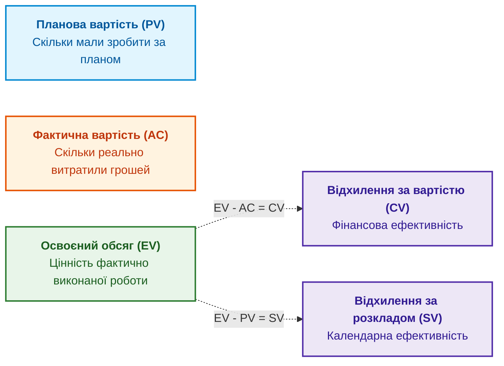
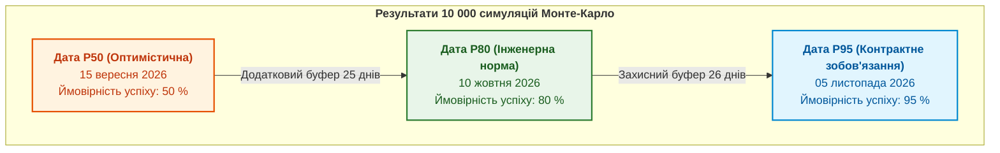

# Глава 9. Освоєний обсяг (EVM) та ймовірнісний прогноз строків за методом Монте-Карло

> **Книга:** [Керування складними інженерними проєктами та програмами](README.md) · [Частина III](part-03-event-driven-management-metrics.md)  
> **Попередня глава:** [Глава 8. Подійно-орієнтоване управління: як інженерні сигнали запускають управлінські реакції](ch08-event-driven-management-and-telemetry.md)  
> **Наступна глава:** [Глава 10. Комплаєнс як щоденний робочий стан: стандарти ISO 26262, DO-178C/254 та IEC 62304](ch10-compliance-as-operational-state.md)  
> **Зміст книги:** [README.md](README.md)  
> **Автор:** [Микола Федчик](about-the-author.md)  
> **Рівень:** фінансові контролери інженерних проєктів, програмні менеджери, директори PMO, системні аналітики  
> **Очікувані результати:** володіти математичним апаратом аналізу освоєного обсягу (EVM) за стандартом ANSI/EIA-748; розраховувати індекси ефективності витрат (CPI) та розкладу (SPI); прогнозувати фінальну вартість при завершенні (EAC); будувати ймовірнісні оцінки термінів проєкту методом моделювання Монте-Карло.

---

## Чому зіставлення плану з фактичними витратами є оманою

У простому фінансовому обліку керівник часто дивиться на два числа: скільки коштів планували витратити за бюджетом до сьогоднішнього дня і скільки фактично списано з банківського рахунку.

Якщо за планом до шостого місяця мали витратити 500 000 доларів, а витратили 400 000 доларів, недосвідчений менеджер робить висновок про економію 100 000 доларів. Проте це висновок без урахування фактично виконаної роботи. Можливо, підрядники ще не поставили необхідні мікросхеми й не зібрали макети, і обсяг реально виконаних робіт оцінюється всього в 250 000 доларів. Тоді замість економії проєкт має катастрофічне відставання від плану та перерозхід бюджету.

Для об'єктивної інтеграції обсягу робіт, календаря та фінансів американський національний стандарт ANSI/EIA-748 визначає методологію **аналізу освоєного обсягу (Earned Value Management, EVM)** [[1]](#src-1).

---

## Математичний апарат аналізу освоєного обсягу (EVM)

Методика спирається на три базові показники, виміряні у фінансовому еквіваленті на момент звітної дати $t$:



1. **Планова вартість (Planned Value, PV):** затверджений бюджет робіт, які згідно з планом мали бути виконані до дати $t$.
2. **Фактична вартість (Actual Cost, AC):** реальні витрати коштів, зафіксовані в бухгалтерії за виконані до дати $t$ роботи.
3. **Освоєний обсяг (Earned Value, EV):** планова вартість фактично завершених і верифікованих на дату $t$ робіт:

```math
EV = \sum_{j \in \mathrm{Completed}} \mathrm{Budget}(j).
```

### Відхилення та індекси ефективності

На основі базової трійки розраховують відхилення та безрозмірні коефіцієнти ефективності:

* **Відхилення за вартістю (Cost Variance, CV):**
  $$CV = EV - AC.$$
  Якщо $CV > 0$, проєкт економить кошти; якщо $CV < 0$, має місце перевитрата.

* **Відхилення за розкладом (Schedule Variance, SV):**
  $$SV = EV - PV.$$
  Якщо $SV > 0$, проєкт випереджає графік; якщо $SV < 0$, відстає.

* **Індекс ефективності витрат (Cost Performance Index, CPI):**
  $$CPI = \frac{EV}{AC}.$$

* **Індекс ефективності розкладу (Schedule Performance Index, SPI):**
  $$SPI = \frac{EV}{PV}.$$

Позначення та інтерпретація індексів:
- Значення $CPI = 1{,}0$ і $SPI = 1{,}0$ свідчать про точне дотримання базової лінії проєкту.
- Якщо $CPI = 0{,}80$, це означає, що на кожен витрачений долар проєкт створює цінності лише на 80 центів (перевитрата 20 %).
- Якщо $SPI = 0{,}85$, це означає, що роботи виконуються лише на 85 % від запланованого календарного темпу.

### Прогнозування підсумкової вартості (EAC)

Якщо поточні тенденції ефективності збережуться до кінця розробки, очікувану фінальну вартість проєкту при завершенні (*Estimate at Completion, EAC*) обчислюють за формулою:

```math
EAC = \frac{BAC}{CPI}.
```

Складники формули:

- $EAC$ є уточненим прогнозом повної вартості проєкту на момент фінішу;
- $BAC$ є вихідним затвердженим бюджетом при завершенні (*Budget at Completion*);
- $CPI$ є поточним індексом ефективності витрат.

Якщо базовий бюджет проекту становить $`BAC = 1\,000\,000`$ доларів, а через інженерні переробки поточний індекс витрат впав до $CPI = 0{,}80$, реальна підсумкова вартість становитиме:

$$EAC = \frac{1\,000\,000}{0{,}80} = 1\,250\,000 \text{ доларів}.$$

Керівництво отримує чіткий фінансовий сигнал: необхідно або залучити додаткові 250 000 доларів, або через процедуру CCB скоротити межі розробки.

---

## Статистичне моделювання термінів за методом Монте-Карло

Головна вада традиційного планування полягає у використанні детермінованих точкових оцінок: інженер стверджує, що розробка плати займе «точно 20 днів». Проте в реальності інженерна діяльність є стохастичним процесом, де на терміни впливають затримки постачання, помилки трасування та доступність тестового обладнання.

Методологія PERT описує тривалість завдання трьома оцінками: оптимістичною ($a$), найбільш імовірною ($m$) та песимістичною ($b$). За бета-розподілом очікуване значення $\mu$ та стандартне відхилення $\sigma$ оцінюють формулами [[2]](#src-2):

```math
\mu = \frac{a + 4m + b}{6},
\qquad \sigma = \frac{b - a}{6}.
```

Для складного графа з десятків завдань аналітичний розрахунок стає неможливим через переплетення залежностей. У таких випадках застосовують **комп'ютерне моделювання за методом Монте-Карло (Monte Carlo Simulation)** [[3]](#src-3).

Алгоритм виконує тисячі віртуальних прогонів проєкту (наприклад, $`N_{\text{iter}} = 10\,000`$). У кожному прогоні тривалість кожного завдання обирається випадковим чином із заданого ймовірнісного розподілу, після чого алгоритм CPM обчислює тривалість критичного шляху.

Результатом моделювання є кумулятивна крива розподілу ймовірності завершення проєкту (S-curve):



Інтерпретація результатів моделювання:
* **Точка P50 (15 вересня):** детермінований розклад за найбільш імовірними оцінками. Ймовірність вкластися в цю дату становить лише 50 % (рівноцінно підкиданню монети). Обіцяти цю дату замовникові є авантюрою.
* **Точка P80 (10 жовтня):** рекомендований внутрішній термін завершення для команди з урахуванням типових ризиків (інженерний буфер).
* **Точка P95 (05 листопада):** дата з 95 % гарантією успіху. Саме цю дату слід фіксувати в зовнішніх юридичних контрактах із замовниками, де за кожен день прострочення передбачені жорсткі штрафні санкції.

---

## Висновок

Поєднання методики освоєного обсягу (EVM) з імовірнісним моделюванням Монте-Карло дає інженерному керівництву повний контроль над економікою та строками програми.

EVM відокремлює реальний фізичний прогрес від формальних витрат коштів і виявляє перевитрати на ранніх етапах. Моделювання Монте-Карло замінює наївний оптимізм математично обґрунтованими інтервалами довіри.

Проте контроль строків і вартості не має сенсу, якщо створений продукт не відповідає нормативним регламентам безпеки. Наступна частина книги присвячена питанням безперервного комплаєнсу, аудиту та формуванню доказової бази релізу.

Відкриває її [Глава 10. Комплаєнс як щоденний робочий стан: стандарти ISO 26262, DO-178C/254 та IEC 62304](ch10-compliance-as-operational-state.md).

---

## Питання для обговорення

1. Чому просте порівняння запланованого бюджету з фактично витраченими коштами може створити оманливе враження про успішність проєкту?
2. Яким чином методика освоєного обсягу (EVM) відокремлює реальне завершення робіт від списання коштів підрядниками?
3. Що показує індекс виконання вартості (CPI), і як на його основі спрогнозувати остаточну вартість проєкту при завершенні (EAC)?
4. Чому використання детермінованих точкових оцінок у календарному плануванні складних апаратних виробів систематично призводить до зриву строків?
5. У чому полягає різниця між датами з імовірністю виконання P50, P80 та P95 за результатами симуляції методом Монте-Карло, і яку дату слід записувати в контракт із замовником?

---

## Словник

- **Аналіз освоєного обсягу (Earned Value Management, EVM):** методологія інтегрованого вимірювання та контролю обсягу виконаних робіт, строків і витрат проєкту на основі єдиної фінансової шкали.
- **Бюджет при завершенні (Budget at Completion, BAC):** загальна планова вартість усіх запланованих робіт проєкту за базовою лінією.
- **Індекс виконання вартості (Cost Performance Index, CPI):** відношення освоєного обсягу до фактично витрачених коштів, що характеризує фінансову ефективність.
- **Індекс виконання розкладу (Schedule Performance Index, SPI):** відношення освоєного обсягу до планової вартості робіт, що характеризує календарний темп робіт.
- **Моделювання Монте-Карло (Monte Carlo Simulation):** чисельний метод математичного аналізу ризиків шляхом багаторазового комп'ютерного розрахунку графа проєкту з випадковим вибором тривалості завдань за їхніми ймовірнісними розподілами.
- **Освоєний обсяг (Earned Value, EV):** бюджетна вартість фактично завершених і перевірених робіт на поточну дату.
- **Оцінка при завершенні (Estimate at Completion, EAC):** актуальний очікуваний підсумковий бюджет проєкту з урахуванням поточної ефективності виконання робіт.
- **Фактична вартість (Actual Cost, AC):** сума реальних фінансових витрат, понесених під час виконання робіт до звітної дати.

---

## Абревіатури

- **AC** (*Actual Cost*): фактична вартість виконаних робіт.
- **BAC** (*Budget at Completion*): затверджений бюджет проєкту при завершенні.
- **CPI** (*Cost Performance Index*): індекс виконання вартості робіт.
- **CV** (*Cost Variance*): відхилення за вартістю.
- **EAC** (*Estimate at Completion*): прогнозована вартість при завершенні.
- **EVM** (*Earned Value Management*): система управління освоєним обсягом.
- **EV** (*Earned Value*): освоєний обсяг робіт.
- **PERT** (*Program Evaluation and Review Technique*): техніка оцінювання та аналізу програм за трьома оцінками.
- **PV** (*Planned Value*): планова вартість робіт за базовою лінією.
- **SPI** (*Schedule Performance Index*): індекс виконання календарного розкладу.
- **SV** (*Schedule Variance*): відхилення за розкладом.
- **WBS** (*Work Breakdown Structure*): структура декомпозиції робіт.

---

## Джерела

1. <a id="src-1"></a>SAE International. [*EIA-748-D: Earned Value Management Systems*](https://www.sae.org/standards/content/eia748d/). SAE, 2019.
2. <a id="src-2"></a>Project Management Institute. [*Practice Standard for Earned Value Management*](https://www.pmi.org/pmbok-guide-standards/frameworks/earned-value-management), 3rd Edition. PMI, 2019.
3. <a id="src-3"></a>David T. Hulett. [*Practical Schedule Risk Analysis*](https://www.routledge.com/Practical-Schedule-Risk-Analysis/Hulett/p/book/9780566087905). Gower Publishing, 2009.

---

[← До Частини III](part-03-event-driven-management-metrics.md) | [До змісту книги](README.md) | [Глава 10 →](ch10-compliance-as-operational-state.md)
