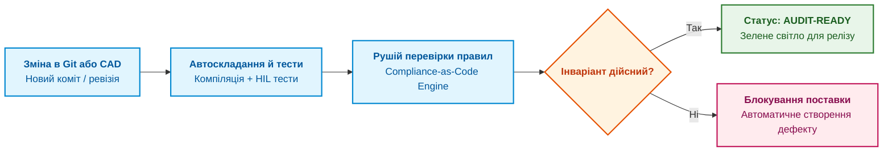

# Глава 10. Комплаєнс як щоденний робочий стан: стандарти ISO 26262, DO-178C/254 та IEC 62304

> **Книга:** [Керування складними інженерними проєктами та програмами](README.md) · [Частина IV](part-04-continuous-compliance-release-evidence.md)  
> **Попередня глава:** [Глава 9. Освоєний обсяг (EVM) та ймовірнісний прогноз строків за методом Монте-Карло](ch09-earned-value-and-probabilistic-forecasting.md)  
> **Наступна глава:** [Глава 11. Докази готовності до релізу: детерміновані шлюзи допуску замість ручних підписів](ch11-release-evidence-and-deterministic-gates.md)  
> **Зміст книги:** [README.md](README.md)  
> **Автор:** [Микола Федчик](about-the-author.md)  
> **Рівень:** директори з якості, системні архітектори, інженери з функціональної безпеки, комплаєнс-офіцери  
> **Очікувані результати:** орієнтуватися у вимогах безпекових стандартів (ISO 26262, DO-178C, DO-254, IEC 62304); перетворити перевірку відповідності нормативам на щоденний автоматизований процес (Compliance-as-Code); формулювати машинозчитувані інваріанти комплаєнсу над цифровою ниткою проєкту.

---

## Паніка перед аудитом: чому паперова сертифікація застаріла

У більшості компаній, що працюють у регуляторних секторах (автомобільна електроніка, авіоніка, медичне приладобудування чи оборонна техніка), сертифікаційний аудит сприймається як стихійне лихо. За кілька місяців до візиту інспекторів розробка практично зупиняється: інженери формують сотні сторінок звітів, малюють вручну матриці трасування вимог (RTM) та підписують протоколи випробувань.

Цей підхід, відомий як «паперовий комплаєнс», має три руйнівні наслідки:
1. **Колосальні непродуктивні витрати:** інженери високої кваліфікації тижнями займаються бюрократичним форматуванням документів замість розв'язання технічних задач.
2. **Низька реальна безпека:** паперовий звіт можна підігнати під вимоги, але це не усуває фізичних дефектів у схемах і прошивках.
3. **Миттєве застарівання:** щойно аудит пройдено, а інженер вніс першу зміну в код, паперова папка з доказами втрачає актуальність.

Сучасна системна інженерія пропонує альтернативу: **комплаєнс як щоденний операційний стан (Compliance as an Operational State)** [[1]](#src-1). Відповідність стандарту має перевірятися автоматично під час кожної зміни коду, кожної ревізії плати та кожного прогону тестів на основі графа цифрової нитки.

---

## Огляд стандартів функціональної безпеки

У критичних доменах діють галузеві стандарти, що встановлюють суворі вимоги до процесів розробки:

| Галузь | Стандарт | Класифікація критичності | Головна вимога стандарту |
| :--- | :--- | :--- | :--- |
| **Автомобільна промисловість** | **ISO 26262** | ASIL A, B, C, D (D є найвищим) | Двоспрямована простежуваність від аналізу загроз HARA до коду й HIL-тестів [[2]](#src-2) |
| **Авіоніка (Програмне забезпечення)** | **DO-178C / ED-12C** | DAL A, B, C, D, E (A є найвищим рівнем) | Покриття коду тестами (MC/DC для DAL A), незалежна верифікація [[3]](#src-3) |
| **Авіоніка (Апаратура)** | **DO-254 / ED-80** | DAL A, B, C, D, E | Простежуваність логіки FPGA, валідація апаратних моделей |
| **Медичні вироби** | **IEC 62304** | Class A, B, C (C для загрози життю) | Інтеграція менеджменту ризиків за ISO 14971 у життєвий цикл коду [[4]](#src-4) |
| **Загальні інженерні процеси** | **ISO/IEC/IEEE 12207** | Системні процеси життєвого циклу | Управління конфігураціями, верифікація та валідація |

Кожен із цих нормативів вимагає довести, що жодна критична функція не реалізована без задокументованої вимоги, і жодна вимога не залишилася без підтвердженого тесту.

---

## Математична формалізація інваріанта комплаєнсу

Замість читання нормативних талмудів перед аудитом, вимоги стандарту записують у вигляді формальних предикатів над графом цифрової нитки $\mathcal{G} = (\mathcal{V}, \mathcal{E})$.

Нехай $\mathcal{R}_{\text{norm}}$ є множиною всіх вимог безпеки проекту. Стан відповідності виробу нормативним регламентам на контрольній точці вважається досягнутим тоді й лише тоді, коли для кожної вимоги виконується логічний інваріант:

```math
\mathrm{CompliancePass}(\mathcal{G}) \iff \bigwedge_{r \in \mathcal{R}_{\text{norm}}} \Big(\mathrm{Verified}(r) \land \lnot \mathrm{HasOpenDefects}(r) \land \mathrm{HardwareMatched}(r)\Big).
```

Позначення та символи:

- $\mathrm{CompliancePass}(\mathcal{G})$ є логічним вердиктом: «істина», якщо граф цифрової нитки задовольняє всі регламенти, і «хиба», якщо виявлено хоча б одне порушення;
- $\mathcal{R}_{\text{norm}}$ є множиною вимог безпеки проєкту;
- $\bigwedge_{r}$ означає логічне «І» за всіма нормативними вимогами без винятку;
- $\mathrm{Verified}(r)$ означає наявність успішно виконаного тесту для вимоги $r$ на актуальній ревізії виробу;
- $\lnot \mathrm{HasOpenDefects}(r)$ вимагає повної відсутності відкритих дефектів, пов'язаних із реалізацією цієї вимоги;
- $\mathrm{HardwareMatched}(r)$ підтверджує, що фізична ревізія змонтованої плати збігається з версією схеми, під яку скомпільовано мікропрограму.

Якщо хоча б для однієї вимоги безпеки тест впав або дефект лишається відкритим, функція повертає значення «хиба», і автоматизований релізний шлюз блокує поставку.

---

## Підхід Compliance-as-Code

Концепція **комплаєнсу як коду (Compliance-as-Code)** перетворює аудит на автоматизований тестовий набір [[1]](#src-1). Правила перевіряються автоматично в конвеєрі CI/CD за кожної спроби злиття гілки або формування релізу:



Коли інспектор чи аудитор приходить на підприємство, компанія не друкує папери: вона відкриває панель цифрової нитки, де в реальному часі відображається статус відповідності кожного пункту ISO 26262 чи DO-178C із посиланнями на криптографічно підписані протоколи автоматизованих випробувань.

---

## Висновок

Трансформація комплаєнсу з паперової рутини на активний операційний стан ліквідує передсертифікаційний параліч інженерної організації.

Формалізація вимог безпекових стандартів у вигляді предикатів Compliance-as-Code дає змогу виявляти відхилення в день їхньої появи, а не за рік під час офіційної інспекції.

Маючи машинозчитувані правила комплаєнсу, компанія готова до впровадження детермінованих релізних шлюзів, які замінюють суб'єктивні людські підписи обчислюваними контрактами безпеки.

Цій темі присвячена [Глава 11. Докази готовності до релізу: детерміновані шлюзи допуску замість ручних підписів](ch11-release-evidence-and-deterministic-gates.md).

---

## Питання для обговорення

1. Чому практика складання звітів про відповідність стандартам вручну перед аудитом не гарантує реальної безпеки складного виробу?
2. Яким чином рівні критичності (ASIL в автопромі, DAL в авіоніці) впливають на суворість вимог до верифікації коду та схемотехніки?
3. Як концепція Compliance-as-Code дозволяє інтегрувати вимоги стандартів ISO 26262 та DO-178C у щоденний конвеєр CI/CD?
4. Що означає умова HardwareMatched в інваріанті комплаєнсу, і чому невідповідність ревізій плати й коду є частим джерелом аварій?
5. Які економічні переваги отримує підприємство, що перейшло від паперової сертифікації до безперервного моніторингу цифрової нитки?

---

## Словник

- **ASIL (Automotive Safety Integrity Level):** класифікація рівнів ризику та повноти безпеки в автомобільній промисловості згідно з ISO 26262 (від A до D).
- **DAL (Development Assurance Level):** рівень гарантії розробки програмного та апаратного забезпечення в авіації згідно з DO-178C і DO-254 (від E до A).
- **Комплаєнс як код (Compliance-as-Code):** підхід до регуляторного контролю, за якого нормативні вимоги записуються у вигляді програмних правил і автоматично перевіряються над артефактами розробки.
- **Операційний комплаєнс:** стан інженерної організації, за якого відповідність регуляторним регламентам є неперервною властивістю повсякденного робочого процесу, а не разовим заходом перед аудитом.
- **Паперовий комплаєнс:** застаріла практика ручної підготовки формальних звітів і підписання документів заднім числом для задоволення вимог інспекторів без реальної верифікації стану виробу.
- **Функціональна безпека (Functional Safety):** властивість системи, що гарантує відсутність неприйнятного ризику фізичної шкоди людям або майну внаслідок збоїв чи помилок електронних і програмних компонентів.

---

## Абревіатури

- **ALM** (*Application Lifecycle Management*): система управління життєвим циклом ПЗ.
- **ASIL** (*Automotive Safety Integrity Level*): автомобільний рівень повноти безпеки.
- **CAD** (*Computer-Aided Design*): система автоматизованого проєктування.
- **CI/CD** (*Continuous Integration / Continuous Delivery*): безперервна інтеграція та доставка коду.
- **DAL** (*Development Assurance Level*): авіаційний рівень гарантії розробки.
- **EDA** (*Electronic Design Automation*): система проєктування електроніки.
- **HARA** (*Hazard Analysis and Risk Assessment*): аналіз небезпек та оцінка ризиків за ISO 26262.
- **HIL** (*Hardware-in-the-Loop*): випробувальний комплекс із фізичним модулем у середовищі моделювання.
- **MC/DC** (*Modified Condition / Decision Coverage*): критерій повного покриття умов і рішень коду тестами для критичних систем.
- **RTM** (*Requirements Traceability Matrix*): матриця простежуваності вимог.

---

## Джерела

1. <a id="src-1"></a>International Organization for Standardization. [*ISO 26262: Road vehicles - Functional safety*](https://www.iso.org/standard/68383.html). ISO, 2018.
2. <a id="src-2"></a>RTCA / EUROCAE. [*DO-178C / ED-12C: Software Considerations in Airborne Systems and Equipment Certification*](https://www.rtca.org/). RTCA, 2011.
3. <a id="src-3"></a>International Electrotechnical Commission. [*IEC 62304: Medical device software - Software life cycle processes*](https://webstore.iec.ch/publication/6923). IEC, 2006/AMD1:2015.
4. <a id="src-4"></a>International Organization for Standardization. [*ISO 14971: Medical devices - Application of risk management to medical devices*](https://www.iso.org/standard/72704.html). ISO, 2019.

---

[← До Частини IV](part-04-continuous-compliance-release-evidence.md) | [До змісту книги](README.md) | [Глава 11 →](ch11-release-evidence-and-deterministic-gates.md)
