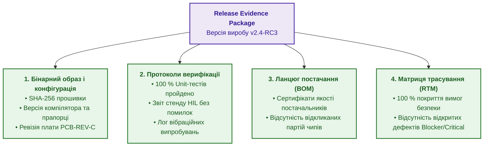
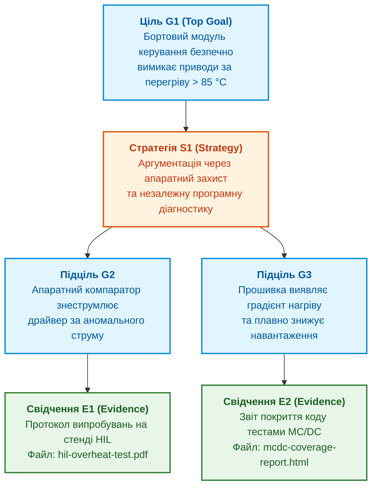

# Глава 11. Докази готовності до релізу: детерміновані шлюзи допуску замість ручних підписів

> **Книга:** [Керування складними інженерними проєктами та програмами](README.md) · [Частина IV](part-04-continuous-compliance-release-evidence.md)  
> **Попередня глава:** [Глава 10. Комплаєнс як щоденний робочий стан: стандарти ISO 26262, DO-178C/254 та IEC 62304](ch10-compliance-as-operational-state.md)  
> **Наступна глава:** [Глава 12. Аудитопридатність за дизайном: незмінні журнали, криптографічні хеші та походження артефактів](ch12-audit-ready-by-design.md)  
> **Зміст книги:** [README.md](README.md)  
> **Автор:** [Микола Федчик](about-the-author.md)  
> **Рівень:** реліз-менеджери, системні архітектори, інженери з якості, технічні директори  
> **Очікувані результати:** формувати машинно-перевірні пакети доказів релізу (Release Evidence Package); впроваджувати детерміновані шлюзи допуску (Admission Gates) за принципом Fail-Closed; структурувати аргументи безпеки за нотацією GSN (Goal Structuring Notation); ліквідувати суб'єктивні ручні погодження випуску продукту.

---

## Ілюзія безпеки через ручні підписи

Перед випуском нової версії прошивки або відправленням партії приладів замовникові в багатьох компаніях запускається процес так званого «погодження релізу». Керівник проєкту обходить кабінети або збирає підписи в корпоративній системі документообігу: підпис схемотехніка, підпис програміста, підпис начальника ОТК, підпис системного архітектора.

Ця процедура створює ілюзію повної надійності: на бланку стоять автографи поважних фахівців. Проте якщо запитати підписантів, на основі чого вони поставили підписи, з'ясовується неприємна правда:
* архітектор повірив розробникові мікропрограм на слово;
* розробник мікропрограм перевірив базові тести, але не знав, що схемотехнік змінив номінал кварцового резонатора;
* начальник ОТК перевірив наявність печаток, але не мав технічної можливості перевірити збіг геш-сум прошивки в приладі.

Суб'єктивний людський підпис не є гарантією якості: він є лише способом розмивання індивідуальної відповідальності. Якщо станеться аварія, кожен підписант скаже: «Я підписав тому, що інші вже підписали переді мною».

Сучасний інженерний підхід замінює суб'єктивний ритуал **детермінованим шлюзом допуску (Admission Gate)** [[1]](#src-1).

---

## Пакет доказів релізу (Release Evidence Package)

Реліз складного виробу не є просто бінарним файлом `.bin` чи металевим блоком у коробці. Реліз є матеріальним об'єктом разом із невіддільним від нього **пакетом обґрунтування (Evidence Package)** [[2]](#src-2).

Пакет доказів формується автоматично конвеєром збирання й містить посилання на цифрову нитку:



Якщо в пакеті бракує хоча б одного доказового елемента (наприклад, не збережено лог калібрування гіроскопа чи не підписано протокол випробувань на електромагнітну сумісність), пакет вважається дефектним, а реліз не існує в юридичному сенсі.

---

## Булева модель шлюзу допуску та принцип Fail-Closed

Рішення про допуск релізу ухвалюється не на нараді, а детермінованою функцією шлюзу, яка перевіряє виконання кон'юнкції суворих умов:

```math
\mathrm{Admit}(R) = \bigwedge_{j=1}^{m} C_j(R).
```

Позначення та зміст:

- $\mathrm{Admit}(R)$ є булевим вердиктом шлюзу для релізу $R$: «істина» (допустити до випуску) або «хиба» (заблокувати);
- $R$ є пакетом доказів релізу, що перевіряється;
- $m$ є кількістю обов'язкових умов допуску;
- $C_j(R)$ є перевіркою $j$-ї умови, яка повертає 1 (виконано) або 0 (порушено);
- $\bigwedge_{j=1}^{m}$ вимагає одночасного виконання всіх $m$ умов без будь-яких винятків.

Типовий перелік обов'язкових умов $C_j$:
* $C_1$: 100 % автоматизованих тестів завершилися успішно на цільовій ревізії обладнання.
* $C_2$: у баг-трекері відсутні відкриті дефекти з пріоритетом Blocker або Critical.
* $C_3$: усі компоненти специфікації BOM мають підтверджені сертифікати походження від офіційних дистриб'юторів.
* $C_4$: статичний аналізатор коду не зафіксував жодного порушення обов'язкових правил стандарту безпеки MISRA C.
* $C_5$: криптографічний геш зібраного бінарного образу підписаний цифровим ключем відповідального інженера-інтегратора.

### Принцип Fail-Closed у релізному управлінні

Шлюз допуску функціонує за принципом **відмови за замовчуванням (Fail-Closed)**: за наявності будь-якої невизначеності, відсутності даних, помилки з'єднання з базою чи неможливості зчитати геш-суму шлюз повертає значення «хиба» й блокує реліз.

Щоб подолати шлюз, потрібні позитивні докази виконання умов, а не відсутність зареєстрованих скарг.

---

## Структурування аргументів безпеки: нотація GSN

Для складних виробів простого переліку галочок недостатньо. Регулятор вимагає показати **аргумент безпеки (Safety Case)**: логічне пояснення, чому саме наведені тести доводять безпечність виробу в конкретних умовах експлуатації.

Міжнародним стандартом для візуалізації та структурування таких аргументів є **нотація структурування цілей (Goal Structuring Notation, GSN)** [[3]](#src-3):



Структура GSN робить аргумент аудитованим:
* **Ціль (Goal):** твердження про безпеку («Двигун гарантовано зупиняється за аварії»).
* **Стратегія (Strategy):** логіка розбиття мети («Доводимо окремо для апаратури й для софту»).
* **Свідчення (Evidence):** конкретний артефакт цифрової нитки (лог тесту, сертифікат, звіт аналізатора).

Якщо свідчення `E1` застаріло або замінено новою версією плати, усе дерево аргументу над ним автоматично позначається як недійсне.

---

## Висновок

Заміна суб'єктивних ручних підписів детермінованими шлюзами допуску переводить процес випуску продукту на математично строгу доказову основу.

Пакет доказів релізу, зв'язаний із цифровою ниткою, гарантує, що кожна вимога безпеки підтверджена свіжими результатами реальних випробувань. Дерева аргументів GSN забезпечують прозорість для міжнародних регуляторів.

Проте докази релізу мають цінність лише тоді, коли їх неможливо підробити чи змінити заднім числом. Наступна глава присвячена технологіям незмінності історії та аудитопридатності за дизайном.

Цій темі присвячена [Глава 12. Аудитопридатність за дизайном: незмінні журнали, криптографічні хеші та походження артефактів](ch12-audit-ready-by-design.md).

---

## Питання для обговорення

1. Чому наявність кількох підписів керівників на документі випуску не гарантує реальної технічної сумісності компонентів виробу?
2. Які обов'язкові артефакти повинен містити машинно-структурований пакет доказів релізу (Release Evidence Package)?
3. Як працює принцип Fail-Closed у роботі автоматизованого шлюзу допуску, і чому він є критичним для безпекових систем?
4. Яким чином графічна нотація GSN допомагає системному архітектору пов'язати високорівневі вимоги безпеки з конкретними технічними логами тестів?
5. Чому спроба надати право «ручного скасування заборони шлюзу» (Manual Override) без фіксації офіційного винятку на CCB руйнує доказову базу проєкту?

---

## Словник

- **Аргумент безпеки (Safety Case):** структуроване, обґрунтоване та підкріплене доказами пояснення того, чому інженерна система є достатньо безпечною для експлуатації в заданому середовищі.
- **Відмова за замовчуванням (Fail-Closed):** архітектурний принцип поведінки захисного механізму, за якого за будь-якої помилки, збою перевірки або браку даних система переходить у максимально безпечний стан блокування.
- **Детермінований шлюз допуску (Admission Gate):** автоматизований програмний фільтр контрольної точки, що перевіряє виконання набору формальних булевих умов перед наданням дозволу на перехід виробу на наступну стадію або випуск у реліз.
- **Нотація структурування цілей (Goal Structuring Notation, GSN):** стандартизована графічна мова для візуалізації, аргументації та структурування доказів у сфері функціональної безпеки та сертифікації.
- **Пакет доказів релізу (Release Evidence Package):** структурована сукупність криптографічно верифікованих цифрових артефактів, що підтверджують відповідність конкретного бінарного образу та апаратної ревізії всім вимогам розробки.

---

## Абревіатури

- **BOM** (*Bill of Materials*): специфікація компонентів і матеріалів.
- **GSN** (*Goal Structuring Notation*): нотація структурування цілей безпеки.
- **HIL** (*Hardware-in-the-Loop*): стендове випробування апаратури з моделюванням середовища.
- **MC/DC** (*Modified Condition / Decision Coverage*): критерій повного покриття умов і рішень коду тестами.
- **MISRA** (*Motor Industry Software Reliability Association*): стандарти безпечного програмування мовою C.
- **OTA** (*Over-the-Air*): дистанційне бездротове оновлення прошивки пристроїв.
- **RC** (*Release Candidate*): кандидат на випуск версії продукту.
- **RTM** (*Requirements Traceability Matrix*): матриця простежуваності вимог.
- **SHA** (*Secure Hash Algorithm*): алгоритм криптографічного гешування даних.

---

## Джерела

1. <a id="src-1"></a>International Organization for Standardization. [*ISO 26262: Road vehicles - Functional safety*](https://www.iso.org/standard/68383.html). ISO, 2018.
2. <a id="src-2"></a>The Assurance Case Working Group. [*Goal Structuring Notation (GSN) Community Standard Version 3*](https://scsc.uk/gsn). SCSC, 2021.
3. <a id="src-3"></a>Robin E. Bloomfield, Peter G. Bishop. [*Safety and Assurance Cases: Past, Present and Possible Future*](https://doi.org/10.1007/978-1-84996-086-1_4). Safety-Critical Systems: Problems and Solutions, Springer, 2010.

---

[← До Частини IV](part-04-continuous-compliance-release-evidence.md) | [До змісту книги](README.md) | [Глава 12 →](ch12-audit-ready-by-design.md)
