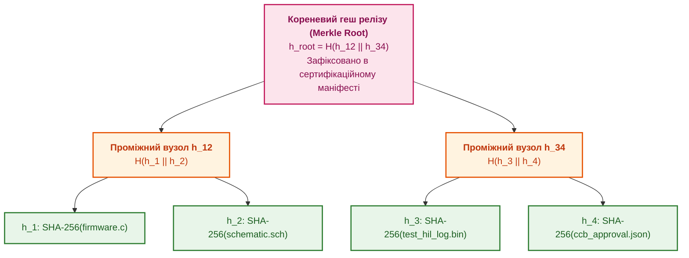

# Глава 12. Аудитопридатність за дизайном: незмінні журнали, криптографічні хеші та походження артефактів

> **Книга:** [Керування складними інженерними проєктами та програмами](README.md) · [Частина IV](part-04-continuous-compliance-release-evidence.md)  
> **Попередня глава:** [Глава 11. Докази готовності до релізу: детерміновані шлюзи допуску замість ручних підписів](ch11-release-evidence-and-deterministic-gates.md)  
> **Наступна глава:** [Глава 13. Продуктовий менеджмент в інженерних дослідженнях: намір, обмеження та системний беклог](ch13-product-management-in-rd.md)  
> **Зміст книги:** [README.md](README.md)  
> **Автор:** [Микола Федчик](about-the-author.md)  
> **Рівень:** директори з безпеки, системні архітектори, комплаєнс-офіцери, провідні DevOps-інженери  
> **Очікувані результати:** проєктувати інженерну інфраструктуру з вбудованою аудитопридатністю (Audit-Ready by Design); застосовувати структури дерев Меркла для контролю цілісності артефактів; реалізовувати незмінні журнали подій із криптографічними підписами; проходити державні й міжнародні аудити за секунди без паперової підготовки.

---

## Чому аудит не повинен бути окремим проєктом

У багатьох компаніях підготовка до аудиту виглядає як авральна мобілізація. Створюється «команда підготовки до аудиту», призначаються додаткові наради, співробітники залишаються на нічні чергування, перевіряючи, чи скрізь сходяться дати в протоколах.

Такий підхід свідчить про низьку процесну зрілість. Якщо для доведення відповідності підприємство змушене проводити спеціальну кампанію, це означає, що в повсякденній роботі процеси не відповідають задекларованим стандартам.

Концепція **аудитопридатності за дизайном (Audit-Ready by Design)** стверджує: інженерне середовище має бути спроєктоване так, щоб будь-який аудит міг бути виконаний у будь-який момент часу без жодної попередньої підготовки [[1]](#src-1).

---

## Математична незмінність: дерева Меркла для інженерних білдів

Як довести зовнішньому інспектору, що бінарний образ прошивки, встановлений на борту автомобіля чи безпілотника, був зібраний саме з перевіреного коду, пройшов усі тести й не модифікувався зловмисником чи випадковим збоєм?

Просте посилання на номер версії в Git є недостатнім: тег можна видалити й перестворити, а базу даних баг-трекера можна змінити прямим запитом SQL.

Для гарантування абсолютної цілісності та незмінності застосовують **дерева гешів (дерева Меркла)**, запропоновані Ральфом Мерклом 1979 року [[2]](#src-2).



Кожен базовий артефакт (код, схема, звіт тесту, протокол CCB) гешується криптографічним алгоритмом SHA-256. Отримані геші попарно конкатенуються й гешуються знову:

```math
h_{\text{root}} = H\bigl(H(h_1 \parallel h_2) \parallel H(h_3 \parallel h_4)\bigr).
```

Позначення та символи:

- $h_{\text{root}}$ є кореневим гешем дерева Меркла (*Merkle Root*), що компактно представляє весь пакет релізу;
- $H(\cdot)$ є стійкою до колізій криптографічною геш-функцією (наприклад, SHA-256);
- $h_1, \dots, h_4$ є гешами окремих інженерних артефактів;
- $\parallel$ є операцією побайтової конкатенації двох рядків гешів.

Кореневий геш $h_{\text{root}}$ має важливу математичну властивість: **зміна хоча б одного біта в будь-якому документі чи лозі тесту повністю змінює значення $h_{\text{root}}$**.

Зафіксувавши один 32-байтовий рядок $h_{\text{root}}$ у незмінному реєстрі та підписавши його електронним підписом відповідального лідера, організація отримує залізне математичне підтвердження того, що наданий аудитору звіт не зазнав жодних редагувань заднім числом.

---

## Незмінні журнали дій (Append-Only Audit Logs)

Управлінські події (затвердження вимог, погодження відхилень на CCB, результати верифікації) повинні зберігатися в журналах із властивістю **додавання лише нових записів (Append-Only Log)** [[3]](#src-3).

У такій системі заборонені операції модифікації (`UPDATE`) чи видалення (`DELETE`). Кожен новий запис містить геш попереднього запису, утворюючи нерозривний ланцюг за принципом блокчейну або криптографічних журналів RFC 6962:

```text
[Запис #101] -> Hash: 0a4f...
  Подія: Затверджено вимогу REQ-042
  Автор: О. Петренко (GPG: 0x9B41...)
  Попередній геш: 8f2c...

[Запис #102] -> Hash: 7e1d...
  Подія: Запит на зміну CR-14 схвалено на CCB
  Автор: М. Федчик (GPG: 0x3F88...)
  Попередній геш: 0a4f...
```

Спроба видалити запис про невдалий тест або підправити рішення комітету призводить до порушення ланцюга гешів, що миттєво фіксується автоматизованою системою аудиту.

---

## Проходження аудиту за 5 хвилин

Коли підприємство впроваджує принципи цифрової нитки та аудитопридатності за дизайном, взаємодія з регуляторними органами кардинально змінюється:

1. **Запит інспектора:** «Покажіть підстави для випуску прошивки версії 2.4».
2. **Дія системи:** оператор вводить ідентифікатор версії в консоль аудиту. Система генерує стандартизований звіт:
   * граф цифрової нитки із зазначенням усіх затверджених вимог;
   * повну матрицю простежуваності (RTM);
   * лог виконання всіх тестів стенду HIL із датами й серійними номерами обладнання;
   * дерево Меркла з математичним доказом цілісності файлів;
   * ланцюг походження за стандартом W3C PROV.
3. **Результат:** інспектор отримує перевірений пакет даних за лічені хвилини без єдиного паперового роздруківки.

Це створює беззаперечну репутацію технологічної зрілості організації та відкриває шлях до контрактів найвищого рівня довіри.

---

## Висновок

Аудитопридатність за дизайном є найвищим ступенем інженерної та управлінської зрілості компанії. Вона усуває сезонний страх перед перевірками, перетворюючи дотримання регламентів на звичну властивість архітектури даних.

Використання математичних структур дерев Меркла та незмінних журналів виключає людський фактор і фальсифікацію доказів, гарантуючи юридичну й технічну чистоту кожного релізу.

На цьому завершується четверта частина книги, присвячена комплаєнсу та доказам. Наступна частина присвячена продуктовому менеджменту, управлінню масштабними програмами та портфельному арбітражу.

Відкриває її [Глава 13. Продуктовий менеджмент в інженерних дослідженнях: намір, обмеження та системний беклог](ch13-product-management-in-rd.md).

---

## Питання для обговорення

1. Чому спроба підготовки компанії до сертифікаційного аудиту у формі окремого аврального проєкту свідчить про системні проблеми в її процесах?
2. Яким чином математична структура дерева Меркла гарантує цілісність сотень файлів інженерного проєкту за допомогою одного 32-байтового кореневого геша?
3. Що являє собою незмінний журнал дій (Append-Only Log), і чому в базах даних управління релізами мають бути заблоковані операції UPDATE і DELETE?
4. Які переваги дає використання відкритої моделі W3C PROV під час розслідування причин польових інцидентів або аварій виробу?
5. Як концепція аудитопридатності за дизайном скорочує витрати бізнесу на проходження регулярних регуляторних перевірок?

---

## Словник

- **Аудитопридатність за дизайном (Audit-Ready by Design):** архітектурна властивість інженерного середовища, за якої всі процеси, артефакти та рішення безперервно протоколюються в незмінному форматі, що дозволяє пройти перевірку в будь-який момент часу без спеціальної підготовки.
- **Дерево Меркла (Merkle Tree):** бінарне дерево криптографічних гешів, де листові вузли містять геші блоків даних, а кожен внутрішній вузол містить геш конкатенації своїх дочірніх вузлів.
- **Журнал лише для додавання (Append-Only Log):** структура даних або сховище, в якому операції модифікації чи видалення існуючих записів заборонені, а нові події можуть записуватися лише в кінець ланцюга.
- **Кореневий геш (Merkle Root):** кореневе значення дерева Меркла, що однозначно ідентифікує стан усієї сукупності включених у дерево файлів і документів.
- **Криптографічний геш:** детермінований алгоритм перетворення довільного масиву даних у фіксований рядок бітів, який є незворотним і чутливим до зміни будь-якого біта вихідного повідомлення.

---

## Абревіатури

- **ALM** (*Application Lifecycle Management*): система управління життєвим циклом ПЗ.
- **CAD** (*Computer-Aided Design*): система автоматизованого конструювання.
- **CCB** (*Change Control Board*): рада з контролю змін.
- **CI/CD** (*Continuous Integration / Continuous Delivery*): безперервна інтеграція та доставка.
- **GPG** (*GNU Privacy Guard*): програма для шифрування та створення цифрових підписів.
- **HIL** (*Hardware-in-the-Loop*): випробування апаратури з комп'ютерною симуляцією середовища.
- **PROV** (*Provenance Model*): стандарт W3C для збереження історії походження даних.
- **RTM** (*Requirements Traceability Matrix*): матриця простежуваності вимог.
- **SHA** (*Secure Hash Algorithm*): алгоритм криптографічного гешування.
- **SQL** (*Structured Query Language*): мова структурованих запитів до реляційних баз даних.

---

## Джерела

1. <a id="src-1"></a>International Organization for Standardization. [*ISO/IEC 27001: Information security, cybersecurity and privacy protection - Information security management systems*](https://www.iso.org/standard/27001). ISO/IEC, 2022.
2. <a id="src-2"></a>Ralph C. Merkle. [*A Certified Digital Signature*](https://doi.org/10.1007/0-387-34805-0_21). Advances in Cryptology - CRYPTO '89, LNCS 435:218–238, Springer, 1989.
3. <a id="src-3"></a>B. Laurie, A. Langley, E. Kasper. [*RFC 6962: Certificate Transparency*](https://www.rfc-editor.org/rfc/rfc6962). IETF, 2013.
4. <a id="src-4"></a>World Wide Web Consortium. [*PROV-DM: The PROV Data Model*](https://www.w3.org/TR/prov-dm/). W3C Recommendation, 2013.

---

[← До Частини IV](part-04-continuous-compliance-release-evidence.md) | [До змісту книги](README.md) | [Глава 13 →](ch13-product-management-in-rd.md)
