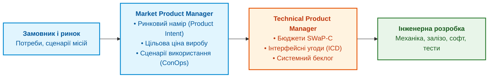

# Глава 13. Продуктовий менеджмент в інженерних дослідженнях: намір, обмеження та системний беклог

> **Книга:** [Керування складними інженерними проєктами та програмами](README.md) · [Частина V](part-05-product-programme-portfolio.md)  
> **Попередня глава:** [Глава 12. Аудитопридатність за дизайном: незмінні журнали, криптографічні хеші та походження артефактів](ch12-audit-ready-by-design.md)  
> **Наступна глава:** [Глава 14. Управління програмою: пулінг системних ризиків, інтеграційні вікна та вигоди](ch14-programme-management-and-systemic-risk.md)  
> **Зміст книги:** [README.md](README.md)  
> **Автор:** [Микола Федчик](about-the-author.md)  
> **Рівень:** продуктові менеджери, системні архітектори, технічні директори, керівники R&D  
> **Очікувані результати:** розмежовувати ролі ринкового та технічного продуктового менеджера в R&D; формулювати продуктовий намір (Product Intent) без передчасного нав'язування схемотехнічних рішень; керувати бюджетами SWaP-C (Size, Weight, Power, and Cost); вести збалансований системний беклог.

---

## Чому класичний Product Owner безпорадний у R&D

У сфері цифрових сервісів продуктовий менеджер (Product Owner) працює з користувацькими історіями (*User Stories*): «Як користувач, я хочу бачити кнопку швидкої оплати, щоб купувати товар в один клік». Зворотний зв'язок від ринку надходить за години через A/B-тестування.

Проте коли компанія розробляє новий радар, автономний безпілотник або систему лазерного наведення, такий підхід зазнає краху:
* кінцевий замовник часто сам не знає фізичних обмежень технології;
* створення дослідного макета займає місяці, тому A/B-тести неможливі на ранніх фазах;
* кожна додаткова вимога замовника має пряму ціну у вазі приладу, споживанні струму, нагріві та вартості компонентів.

Спроба писати поверхневі користувацькі історії для інженерів призводить до взаємного роздратування. Схемотехнікам і конструкторам потрібен не абстрактний опис емоцій користувача, а чіткі інженерні обмеження та фізичні атрибути якості.

Для цього в інженерних організаціях розмежовують ролі **ринкового продуктового менеджера (Market PM)** та **технічного продуктового менеджера (Technical PM)** [[1]](#src-1).

---

## Ринковий та технічний продуктовий менеджер

Розподіл обов'язків між двома продуктовими лідерами забезпечує баланс між комерційними цілями й фізичними законами:



1. **Market PM (Ринковий менеджер):** досліджує сценарії використання, спілкується з операторами техніки, аналізує конкурентів і формує **продуктовий намір (Product Intent)** та концепцію використання (*Concept of Operations, ConOps*). Він відповідає на запитання: «Яку проблему оператора ми розв'язуємо, і скільки ринок готовий заплатити за цей комплекс?».
2. **Technical PM (Технічний менеджер):** разом із системним архітектором транслює намір у системні інженерні вимоги, визначає межі допустимих компромісів і керує системним беклогом. Він відповідає на запитання: «Які фізичні параметри, стандарти та інтерфейси зроблять цей виріб реалізованим?».

---

## Бюджети SWaP-C: мистецтво системного компромісу

Складний інженерний виріб завжди обмежений чотирма фізичними та економічними параметрами: **розміром, масою, споживанням енергії та собівартістю (Size, Weight, Power, and Cost: SWaP-C)** [[2]](#src-2).

Будь-яка додаткова функція вимагає ресурсів:
* додавання процесора вищої швидкодії для обробки відео збільшує споживання енергії ($P$);
* більше споживання струму вимагає масивнішої батареї та більшого радіатора охолодження, що збільшує масу ($W$) і габарити ($S$);
* більша маса вимагає двигунів підвищеної тяги, які коштують дорожче ($C$).

Щоб не допустити неконтрольованого зростання параметрів, технічний продуктовий менеджер веде бюджетний компроміс виробу, який математично оцінюють цільовою функцією штрафу за перевищення лімітів:

```math
\Phi_{\text{SWaP}} = w_s \frac{S}{S_{\max}} + w_w \frac{W}{W_{\max}} + w_p \frac{P}{P_{\max}} + w_c \frac{C}{C_{\max}}.
```

Позначення та коефіцієнти:

- $\Phi_{\text{SWaP}}$ є безрозмірним індексом навантаження на системні бюджети виробу;
- $S, W, P, C$ є фактичними проєктними значеннями розміру (об'єму в дм³), маси (в кг), споживання енергії (у Вт) та собівартості компонентів BOM (у доларах);
- $S_{\max}, W_{\max}, P_{\max}, C_{\max}$ є гранично допустимими лімітами за специфікацією виробу;
- $w_s, w_w, w_p, w_c$ є ваговими коефіцієнтами пріоритету, сума яких дорівнює одиниці ($w_s + w_w + w_p + w_c = 1$).

Якщо значення індексу $\Phi_{\text{SWaP}} > 1{,}0$, виріб вийшов за рамки системних обмежень і не зможе виконувати цільову місію (наприклад, безпілотник не підніметься в повітря або час польоту скоротиться нижче вимоги замовника).

---

## Системний беклог: поєднання функцій, боргів і досліджень

У чистій веб-розробці беклог часто наповнений лише бізнес-функціями. В інженерному комплексі такий беклог призводить до глухого кута.

Збалансований **системний беклог** під керівництвом Technical PM містить чотири типи задач:

1. **Функціональні вимоги продукту (Features):** нові можливості для оператора (наприклад, «Режим автосупроводу рухомої цілі»).
2. **Технологічні розвідки (Spikes):** дослідницькі роботи з високою невизначеністю (наприклад, «Випробування нового радіомодема на стійкість до завад РЕБ протягом 5 днів»).
3. **Зниження технічного боргу (Technical Debt):** рефакторинг драйверів, оптимізація розміщення компонентів на платі для покращення теплообміну, оновлення версії компілятора.
4. **Інфраструктурні роботи (Enablers):** виготовлення стендів HIL, оновлення ліцензій САПР, підготовка оснастки для фабричного калібрування.

Продуктовий лідер зобов'язаний виділяти фіксовану частку інженерної ємності (наприклад, 25 % часу) на дослідження та ліквідацію боргу, інакше розвиток комплексу зупиниться через неможливість підтримувати старий заплутаний код і схеми.

---

## Висновок

Продуктовий менеджмент в інженерному R&D є мистецтвом перекладу ринкових амбіцій мовою суворих фізичних і регуляторних обмежень.

Поділ обов'язків між ринковим і технічним менеджерами забезпечує баланс між цінністю для споживача та системною реалізовністю виробу. Керування бюджетами SWaP-C запобігає розповзанню маси, вартості й енергоспоживання.

Коли окремий продукт має чіткий намір, наступним рівнем складності стає об'єднання кількох продуктів у спільну програму.

Цьому присвячена наступна глава: [Глава 14. Управління програмою: пулінг системних ризиків, інтеграційні вікна та вигоди](ch14-programme-management-and-systemic-risk.md).

---

## Питання для обговорення

1. Чому стандартні методики Agile та концепція Product Owner, створені для веб-сервісів, не працюють без адаптації в апаратно-програмних R&D-проєктах?
2. Яким чином розподіляються обов'язки між ринковим продуктовим менеджером (Market PM) та технічним продуктовим менеджером (Technical PM)?
3. Чому концепція бюджетів SWaP-C є головним інструментом прийняття компромісних рішень під час проєктування кіберфізичних систем?
4. Які чотири типи задач повинен обов'язково містити системний беклог інженерного підприємства, і чому не можна заповнювати його лише функціями для користувача?
5. Що являє собою технологічна розвідка (Spike), і як обмежувати її в часі, щоб уникнути нескінченних академічних досліджень без результату?

---

## Словник

- **Бюджет SWaP-C:** кількісний розподіл обмежень за розміром (Size), вагою (Weight), енергоспоживанням (Power) та собівартістю (Cost) між окремими підсистемами виробу.
- **Документ вимог до продукту (PRD):** документ, що фіксує функціональні й нефункціональні параметри створюваного пристрою з точки зору ринку та користувача.
- **Концепція використання (ConOps):** формальний опис сценаріїв застосування виробу в реальному середовищі з точки зору кінцевого оператора.
- **Продуктовий намір (Product Intent):** високорівнева декларація споживчої мети й ціннісної пропозиції продукту, яка залишає інженерам свободу у виборі конкретної архітектури.
- **Ринковий продуктовий менеджер (Market PM):** фахівець, що відповідає за зв'язок із ринком, бізнес-модель, ціноутворення та розуміння потреб споживачів.
- **Системний беклог:** упорядкований перелік усіх запланованих робіт над виробом, що включає функціональні задачі, дослідження, технічний борг та інфраструктуру.
- **Технічний продуктовий менеджер (Technical PM):** інженерний лідер, що відповідає за трансляцію ринкових вимог у технічні специфікації, бюджети та інтерфейси.
- **Технологічна розвідка (Spike):** короткострокове часово-обмежене дослідження або створення прототипу для зниження невизначеності щодо нової технології чи архітектурного рішення.

---

## Абревіатури

- **BOM** (*Bill of Materials*): перелік матеріалів і компонентів.
- **ConOps** (*Concept of Operations*): концепція експлуатації виробу.
- **HIL** (*Hardware-in-the-Loop*): стендове випробування апаратури з імітацією середовища.
- **ICD** (*Interface Control Document*): документ контролю міжсистемних інтерфейсів.
- **PRD** (*Product Requirements Document*): документ вимог до продукту.
- **R&D** (*Research and Development*): наукові дослідження та дослідно-конструкторські розробки.
- **SWaP-C** (*Size, Weight, Power, and Cost*): габарити, вага, енергоспоживання та собівартість.

---

## Джерела

1. <a id="src-1"></a>Marty Cagan. [*Inspired: How to Create Tech Products Customers Love*](https://www.wiley.com/en-us/Inspired%3A+How+to+Create+Tech+Products+Customers+Love%2C+2nd+Edition-p-9781119387503), 2nd Edition. Wiley, 2017.
2. <a id="src-2"></a>International Council on Systems Engineering. [*INCOSE Systems Engineering Handbook: A Guide for System Life Cycle Processes and Activities*](https://doi.org/10.1002/9781119516828), 4th Edition. Wiley, 2015.
3. <a id="src-3"></a>Dean Leffingwell. [*SAFe Distilled: Achieving Business Agility with the Scaled Agile Framework*](https://www.pearson.com/en-us/subject-catalog/p/safe-distilled-achieving-business-agility-with-the-scaled-agile-framework/P200000000494). Addison-Wesley, 2020.

---

[← До Частини V](part-05-product-programme-portfolio.md) | [До змісту книги](README.md) | [Глава 14 →](ch14-programme-management-and-systemic-risk.md)
