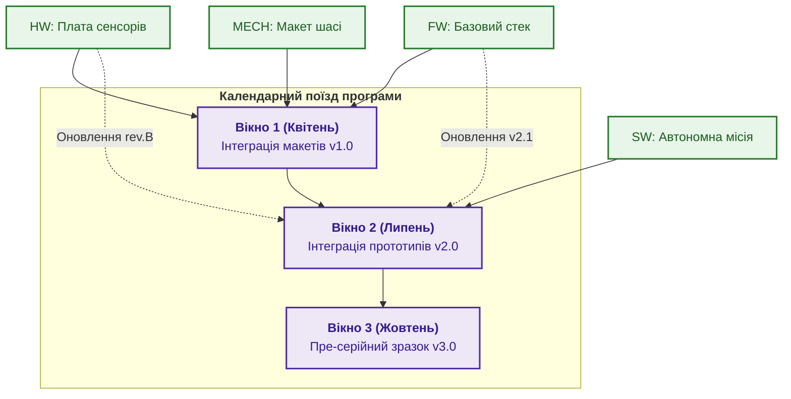

# Глава 14. Управління програмою: пулінг системних ризиків, інтеграційні вікна та вигоди

> **Книга:** [Керування складними інженерними проєктами та програмами](README.md) · [Частина V](part-05-product-programme-portfolio.md)  
> **Попередня глава:** [Глава 13. Продуктовий менеджмент в інженерних дослідженнях: намір, обмеження та системний беклог](ch13-product-management-in-rd.md)  
> **Наступна глава:** [Глава 15. Портфельне управління: як обирати, фінансувати, перерозподіляти ресурси та вчасно зупиняти проєкти](ch15-portfolio-governance-and-capital-allocation.md)  
> **Зміст книги:** [README.md](README.md)  
> **Автор:** [Микола Федчик](about-the-author.md)  
> **Рівень:** програмні директори, керівники великих комплексних програм, системні архітектори  
> **Очікувані результати:** управляти системними ризиками на міжпроєктному рівні через пулінг резервів; проєктувати інтеграційні вікна для узгодження релізів; відстежувати досягнення стратегічних вигод (Benefits Realization); арбітрувати технічні суперечки між підпроєктами.

---

## Програма як система взаємопов'язаних ефектів

Коли організація створює масштабний інженерний комплекс (наприклад, автономну систему ППО чи комплекс розвідки), окремі підпроєкти розробляють окремі команди: одна робить радарну антену, друга розробляє цифрову платформу обробки сигналів, третя створює гусеничне шасі, четверта пише софт командного пункту.

Кожен окремий проєктний менеджер прагне захистити власний проєкт: закласти максимальний резерв часу, вимагати пріоритетного фінансування та перекласти ризики на сусідів. Якщо кожен із 10 проєктів закладе власний 30 % буфер часу й бюджету, загальна вартість програми зросте в рази, а строки виходу виробу розтягнуться на роки.

Завдання **програмного менеджера** полягає в оптимізації системи в цілому: замість розпорошення резервів по окремих кімнатах, програма об'єднує невизначеність за допомогою **пулінгу ризиків (Risk Pooling)** [[1]](#src-1).

---

## Математичний апарат пулінгу ризиків

В основі програмного пулінгу лежить закон додавання дисперсій випадкових величин. 

Нехай програма об'єднує $n$ підпроєктів, і кожен підпроєкт стикається з випадковими відхиленнями витрат або строків $X_i$ із середнім квадратичним відхиленням $\sigma_i$. Якщо кожен менеджер страхує свій ризик ізольовано, сумарний розмір необхідного резерву є простою сумою відхилень:

$$B_{\text{isolated}} = \sum_{i=1}^{n} k \sigma_i.$$

Якщо ж управління ризиками централізовано на рівні програми, дисперсія загального відхилення програми $\sigma^2_{\text{prog}}$ становить:

```math
\sigma^2_{\text{prog}} = \sum_{i=1}^{n}\sigma_i^2 + 2\sum_{1 \le i < j \le n} \mathrm{Cov}(X_i, X_j).
```

Позначення та величини:

- $\sigma^2_{\text{prog}}$ є сумарною дисперсією строків або вартості на рівні програми;
- $\sigma_i^2$ є індивідуальною дисперсією відхилення $i$-го підпроєкту;
- $\mathrm{Cov}(X_i, X_j)$ є коваріацією (ступенем статистичної залежності) між ризиками підпроєктів $i$ та $j$;
- якщо ризики підпроєктів є незалежними ($\mathrm{Cov} \approx 0$), сумарне стандартне відхилення дорівнює кореню з суми дисперсій:

$$\sigma_{\text{prog}} = \sqrt{\sum_{i=1}^{n}\sigma_i^2} < \sum_{i=1}^{n}\sigma_i.$$

Ефект пулінгу ризиків очевидний на простому розрахунку. Нехай програма містить $n = 4$ незалежні інженерні підпроєкти, і кожен має можливе відхилення строків $\sigma_i = 10$ днів.
* При ізольованому страхуванні сумарний буфер становить:
  $$B_{\text{isolated}} = 4 \times 10 = 40 \text{ днів}.$$
* При централізованому програмному пулінгу спільний буфер становить:
  $$\sigma_{\text{prog}} = \sqrt{10^2 + 10^2 + 10^2 + 10^2} = \sqrt{400} = 20 \text{ днів}.$$

Програма економить 20 днів календарного резерву (удвічі менший буфер за того самого рівня захисту). Якщо один підпроєкт затримається, він тимчасово запозичить частину спільного буфера, який не знадобився іншому проєкту, що завершився раніше або вчасно.

---

## Інтеграційні вікна та релізні поїзди

Щоб різні частини програми не зупиняли одна одну, програмний менеджмент впроваджує практику **інтеграційних вікон (Integration Windows)** або **релізних поїздів (Release Trains)** [[2]](#src-2):



Принцип роботи простий і суворий:
1. Поїзд відправляється за точним розкладом (наприклад, кожні 12 тижнів).
2. Якщо підпроєкт встиг завершити свою ревізію й пройти приймальні тести, його компонент сідає в поїзд і потрапляє на стенд загальної інтеграції.
3. Якщо підпроєкт не встиг або не надав доказів якості, поїзд не чекає: на стенді залишається попередня стабільна версія компонента, а запізніла ревізія чекає наступного вікна.

Це усуває параліч, коли дев'ять команд місяцями простоюють через затримку в десятій.

---

## Управління реалізацією вигод (Benefits Realization)

Головна відмінність програми від проєкту полягає в тому, що програма не закінчується актом передавання «заліза й дисків» замовникові. Програма відповідає за **реалізацію вигод (Benefits Realization Management, BRM)** [[3]](#src-3).

Програмний офіс відстежує:
* чи скоротився час розгортання комплексу в польових умовах до нормативних 15 хвилин;
* чи знизилася вартість сервісного обслуговування на 30 %, як закладалося в бізнес-моделі;
* чи забезпечує виріб безвідмовну роботу протягом 1000 годин експлуатації.

Якщо технічно система зібрана коректно, але оператор на практиці не може її використовувати через надмірну складність інтерфейсу, програма не вважається успішною.

---

## Висновок

Програмне управління є вищим пілотажем інженерного керівництва. Воно нейтралізує міжпроєктний егоїзм, об'єднує резерви через математичний пулінг ризиків та створює регулярний ритм інтеграції за допомогою релізних поїздів.

Програма гарантує, що технічні зусилля команд трансформуються в реальні експлуатаційні та ринкові вигоди.

Проте сама програма є лише однією з багатьох інвестицій підприємства. Щоб обрати правильні програми й розподілити між ними капітал компанії, необхідний найвищий рівень управління: портфельний.

Цій темі присвячена [Глава 15. Портфельне управління: як обирати, фінансувати, перерозподіляти ресурси та вчасно зупиняти проєкти](ch15-portfolio-governance-and-capital-allocation.md).

---

## Питання для обговорення

1. Чому практика створення індивідуальних буферів часу й бюджету в кожному окремому підпроєкті призводить до колосального подорожчання всієї програми?
2. Як математичний закон додавання дисперсій доводить економічну вигоду централізованого програмного пулінгу ризиків?
3. Що являє собою принцип релізного поїзда (Release Train), і чому запізнілі компоненти не повинні зупиняти відправлення чергового релізу?
4. У чому полягає різниця між здачею матеріальних результатів проєкту (Deliverables) та реалізацією стратегічних вигод програми (Benefits Realization)?
5. Як програмний менеджер повинен діяти в ситуації, коли два підпроєкти вимагають монопольного доступу до єдиного в компанії випробувального стенду?

---

## Словник

- **Інтеграційне вікно:** попередньо визначений і зафіксований у розкладі інтервал часу для збирання й сумісного тестування всіх підсистем комплексу.
- **Коваріація ризиків:** статистична міра взаємозв'язку між відхиленнями двох проєктів (позитивна коваріація означає, що затримка одного зазвичай супроводжується затримкою іншого).
- **Пулінг ризиків (Risk Pooling):** практика централізованого об'єднання невизначеностей і резервів на рівні програми, що дозволяє зменшити сумарний буфер безпеки за рахунок взаємної компенсації відхилень.
- **Реалізація вигод (Benefits Realization):** безперервний процес планування, вимірювання та контролю досягнення запланованих бізнес-ефектів і практичної користі після передавання виробу в експлуатацію.
- **Релізний поїзд (Release Train):** модель організації спільних випусків, за якої інтеграція та релізи здійснюються за суворим фіксованим календарним розкладом незалежно від готовності окремих функцій.

---

## Абревіатури

- **BRM** (*Benefits Realization Management*): управління реалізацією стратегічних вигод.
- **CAD** (*Computer-Aided Design*): система автоматизованого конструювання.
- **Cov** (*Covariance*): математична коваріація випадкових величин.
- **FW** (*Firmware*): вбудоване мікропрограмне забезпечення.
- **HIL** (*Hardware-in-the-Loop*): випробувальний комплекс із підключенням фізичної плати.
- **HW** (*Hardware*): апаратні електронні засоби.
- **MECH** (*Mechanical*): механічні деталі та вузли конструкції.
- **PMO** (*Program/Project Management Office*): офіс управління програмами та проєктами.
- **SW** (*Software*): прикладне програмне забезпечення.

---

## Джерела

1. <a id="src-1"></a>Project Management Institute. [*The Standard for Program Management*](https://www.pmi.org/pmbok-guide-standards/foundational/program-management), 4th Edition. PMI, 2017.
2. <a id="src-2"></a>Dean Leffingwell. [*SAFe Distilled: Achieving Business Agility with the Scaled Agile Framework*](https://www.pearson.com/en-us/subject-catalog/p/safe-distilled-achieving-business-agility-with-the-scaled-agile-framework/P200000000494). Addison-Wesley, 2020.
3. <a id="src-3"></a>Carlos Serra. [*Benefits Realization Management: Strategic Value from Portfolios, Programs, and Projects*](https://doi.org/10.1201/b20468). CRC Press, 2016.

---

[← До Частини V](part-05-product-programme-portfolio.md) | [До змісту книги](README.md) | [Глава 15 →](ch15-portfolio-governance-and-capital-allocation.md)
