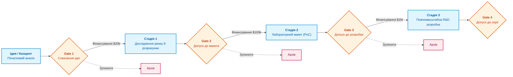

# Глава 15. Портфельне управління: як обирати, фінансувати, перерозподіляти ресурси та вчасно зупиняти проєкти

> **Книга:** [Керування складними інженерними проєктами та програмами](README.md) · [Частина V](part-05-product-programme-portfolio.md)  
> **Попередня глава:** [Глава 14. Управління програмою: пулінг системних ризиків, інтеграційні вікна та вигоди](ch14-programme-management-and-systemic-risk.md)  
> **Наступна глава:** [Глава 16. Зрілість проєктного офісу (PMO) та стратегія платформи: створювати, купувати чи інтегрувати](ch16-pmo-maturity-and-platform-strategy.md)  
> **Зміст книги:** [README.md](README.md)  
> **Автор:** [Микола Федчик](about-the-author.md)  
> **Рівень:** генеральні директори, фінансові директори, віцепрезиденти з R&D, члени портфельних комітетів  
> **Очікувані результати:** впроваджувати стадійно-шлюзову модель фінансування (Stage-Gate); розраховувати очікувану чисту приведену вартість (eNPV) з урахуванням технічних ризиків; застосовувати об'єктивні правила для вчасного закриття неефективних ініціатив (Project Killing); долати пастку неповоротних витрат.

---

## Чому почати проєкт легко, а зупинити майже неможливо

Найбільш дефіцитним ресурсом будь-якого високотехнологічного підприємства є не кошти інвесторів, а час провідних інженерів, архітекторів і конструкторів. Гроші можна залучити на ринку, але підготувати фахівця зі знанням специфіки системної інтеграції займає роки.

Типова хвороба інженерного портфеля полягає у відкритті десятків привабливих ініціатив без встановлення лімітів. Кожна ідея здається перспективною, кожен керівник просить невеликий початковий бюджет.

У результаті ресурси компанії виявляються тонким шаром розмазані між 20 паралельними розробками:
* жоден проєкт не отримує достатньої уваги для швидкого прориву;
* терміни розтягуються втричі;
* коли стає очевидно, що певний напрям зайшов у глухий кут, керівництво боїться закрити проєкт через тиск витрачених коштів (*Sunk Cost Fallacy*).

Зріле портфельне управління фокусується не на запуску робіт, а на жорсткому відборі та **своєчасному закритті проєктів (Project Killing)** [[1]](#src-1).

---

## Стадійно-шлюзова модель фінансування (Stage-Gate)

Для мінімізації інвестиційних ризиків компанія фінансує R&D-ініціативи не одноразово на весь період розробки, а поетапно, використовуючи **модель стадій та шлюзів (Stage-Gate Process)** Роберта Купера [[2]](#src-2):



Кожен шлюз (Gate) є точкою інвестиційного арбітражу, де комітет ухвалює одне з чотирьох рішень:
1. **Go (Продовжити):** проєкт виконав цілі поточної стадії, зберіг ринкову актуальність і отримує фінансування на наступний етап.
2. **Kill (Закрити):** проєкт не підтвердив технічну життєздатність або ринкові параметри змінилися; фінансування негайно припиняється, напрацьовані патенти й результати передаються до бази знань.
3. **Hold (Призупинити):** проєкт визнано корисним, але через пріоритетніші завдання він тимчасово заморожується для вивільнення інженерних ресурсів.
4. **Recycle (Доопрацювати):** повернення на поточну стадію для усунення недоліків без виділення наступного траншу.

---

## Фінансовий апарат: очікувана чиста приведена вартість (eNPV)

У класичному фінансовому аналізі проєкти оцінюють за чистою приведеною вартістю (*Net Present Value, NPV*). Проте для інженерних інновацій класичний NPV є оманливим, оскільки не враховує ймовірності технічного успіху (*Probability of Technical Success, $P_{ts}$*) та ринкового успіху (*Probability of Commercial Success, $P_{cs}$*).

Для R&D-ініціатив портфельний комітет розраховує **очікувану чисту приведену вартість (Expected NPV, eNPV)**:

```math
eNPV = \sum_{t=0}^{T} \frac{CF_t \cdot P_{\text{success}}}{(1 + r)^t} - I_0.
```

Позначення та змінні:

- $eNPV$ є очікуваною чистою приведеною вартістю ініціативи з урахуванням факторів ризику, у грошових одиницях;
- $CF_t$ є чистим грошовим потоком у період $t$ після виходу виробу на ринок;
- $P_{\text{success}} = P_{ts} \times P_{cs}$ є сукупною ймовірністю успіху (добуток ймовірності створити працюючий прилад на ймовірність його продати);
- $r$ є ставкою дисконтування компанії (вартістю капіталу), вираженою часткою одиниці;
- $t$ є номером календарного періоду (року) від 0 до горизонту прогнозування $T$;
- $I_0$ є початковими інвестиціями в дослідження та розробку.

Якщо ініціатива обіцяє теоретичний дохід у 10 мільйонів доларів ($NPV = \$10M$), але технічна ймовірність реалізувати складний фізичний принцип становить лише 20 % ($P_{ts} = 0{,}20$), а ймовірність виграти тендер 50 % ($P_{cs} = 0{,}50$), очікуваний успіх становить:

$$P_{\text{success}} = 0{,}20 \times 0{,}50 = 0{,}10 \text{ (лише 10 \%)}.$$

Реальна оцінка $eNPV$ може виявитися від'ємною після врахування високих витрат на розробку $I_0$. Портфельний комітет отримує об'єктивний критерій відхилення авантюрних ідей на користь проєктів із вищою ймовірністю комерціалізації.

---

## Культура своєчасного закриття проєктів (Project Killing)

Закриття проєкту в багатьох організаціях сприймається як трагедія чи персональна поразка інженерної команди. Це небезпечний забобон. 

У передових науково-дослідних центрах закриття проєкту є стандартним робочим інструментом збереження ресурсів. Якщо з десяти розпочатих стадійних проєктів компанія закриває сім на ранніх етапах (Gate 1 і Gate 2), вона звільняє найкращих фахівців для концентрації на трьох ініціативах-переможцях.

Правила здорового закриття проєктів:
1. **Об'єктивні тригери:** критерії закриття мають бути зафіксовані заздалегідь (наприклад, собівартість приладу перевищує 500 доларів або час автономної роботи менше 2 годин).
2. **Відсутність покарань:** команда закритого проєкту не повинна зазнавати дискримінації чи втрати бонусів; навпаки, своєчасне визнання безперспективності напряму має заохочуватися.
3. **Збереження знань:** усі негативні результати експериментів, схеми та кодові бази документуються в корпоративній базі знань. Негативний результат експерименту є цінним активом компанії, що захищає від повторних помилок у майбутньому.

---

## Висновок

Портфельне управління є вищим рівнем стратегічного арбітражу інженерного підприємства. Воно забезпечує концентрацію інтелектуального капіталу на найбільш життєздатних напрямках.

Стадійно-шлюзова модель фінансування усуває ризик масштабних фінансових втрат, а розрахунок eNPV замінює суб'єктивні захоплення об'єктивною ймовірнісною оцінкою. Вчасне закриття безперспективних розробок є ознакою найвищої зрілості організації.

У заключній частині книги ми розглянемо, як побудувати технологічну платформу, розвинути інженерний офіс управління (PMO) та відповідально застосовувати штучний інтелект для підтримки описаних процесів.

Цьому присвячена [Глава 16. Зрілість проєктного офісу (PMO) та стратегія платформи: створювати, купувати чи інтегрувати](ch16-pmo-maturity-and-platform-strategy.md).

---

## Питання для обговорення

1. Чому надмірна кількість одночасно відкритих інженерних ініціатив у портфелі призводить до падіння швидкості випуску продукції всієї компанії?
2. Як працює стадійно-шлюзова модель (Stage-Gate Process) Роберта Купера, і які чотири рішення може ухвалити портфельний комітет на шлюзі?
3. Чому класичний показник NPV є непридатним для оцінки ризикованих науково-дослідних проєктів без урахування ймовірності технічного успіху (eNPV)?
4. Що таке психологічна пастка неповоротних витрат (Sunk Cost Fallacy), і яким чином вона спонукає менеджерів продовжувати фінансування безнадійних розробок?
5. Як організувати процедуру закриття проєкту (Project Killing) так, щоб зберегти мотивацію інженерів і зафіксувати напрацьовані знання в базі організації?

---

## Словник

- **Дисконтування:** метод приведення вартості майбутніх грошових потоків до поточного моменту часу з урахуванням вартості капіталу й ризику.
- **Модель стадій і шлюзів (Stage-Gate):** методологія поетапного управління інвестиціями в R&D від вихідної ідеї до масового виробництва через контрольні точки рішень.
- **Неповоротні витрати (Sunk Costs):** інвестиції коштів і праці, які вже відбулися в минулому і не можуть бути повернуті за будь-якого рішення щодо майбутнього проєкту.
- **Очікувана чиста приведена вартість (eNPV):** фінансовий показник чистого приведеного доходу проєкту, зважений на ймовірність технічної реалізації та комерційного успіху.
- **Пастка неповоротних витрат (Sunk Cost Fallacy):** когнітивне викривлення, через яке люди продовжують інвестувати ресурси у збитковий проєкт лише тому, що в нього вже вкладено багато праці чи грошей.
- **Портфельний комітет:** вищий колегіальний орган управління підприємства, уповноважений затверджувати стратегічні пріоритети, відкривати, фінансувати й закривати програми та проєкти.

---

## Абревіатури

- **CapEx** (*Capital Expenditure*): капітальні витрати на придбання довгострокових активів.
- **CF** (*Cash Flow*): грошовий потік проєкту.
- **eNPV** (*Expected Net Present Value*): очікувана чиста приведена вартість із врахуванням імовірності успіху.
- **NPV** (*Net Present Value*): чиста приведена вартість.
- **OpEx** (*Operational Expenditure*): операційні витрати на забезпечення поточної діяльності.
- **PMO** (*Portfolio/Program Management Office*): офіс управління портфелями та програмами.
- **PoC** (*Proof of Concept*): лабораторний макет для підтвердження фізичної життєздатності ідеї.
- **R&D** (*Research and Development*): дослідження та розробка нових технологій і виробів.
- **ROI** (*Return on Investment*): показник рентабельності інвестицій.

---

## Джерела

1. <a id="src-1"></a>Robert G. Cooper. [*Winning at New Products: Creating Value Through Innovation*](https://www.basicbooks.com/), 5th Edition. Basic Books, 2017.
2. <a id="src-2"></a>Project Management Institute. [*The Standard for Portfolio Management*](https://www.pmi.org/pmbok-guide-standards/foundational/portfolio-management), 4th Edition. PMI, 2017.
3. <a id="src-3"></a>Richard A. Brealey, Stewart C. Myers, Franklin Allen. [*Principles of Corporate Finance*](https://www.mheducation.com/highered/product/principles-corporate-finance-brealey-myers/M9781260013900.html), 13th Edition. McGraw-Hill, 2020.

---

[← До Частини V](part-05-product-programme-portfolio.md) | [До змісту книги](README.md) | [Глава 16 →](ch16-pmo-maturity-and-platform-strategy.md)
