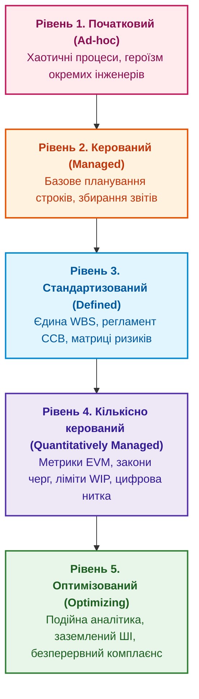

# Глава 16. Зрілість проєктного офісу (PMO) та стратегія платформи: створювати, купувати чи інтегрувати

> **Книга:** [Керування складними інженерними проєктами та програмами](README.md) · [Частина VI](part-06-pmo-platform-strategy-ai.md)  
> **Попередня глава:** [Глава 15. Портфельне управління: як обирати, фінансувати, перерозподіляти ресурси та вчасно зупиняти проєкти](ch15-portfolio-governance-and-capital-allocation.md)  
> **Наступна глава:** [Глава 17. ШІ-асистент проєктного менеджера: заземлення на цифрову нитку, виявлення блокерів та межі довіри](ch17-ai-assistants-in-project-management.md)  
> **Зміст книги:** [README.md](README.md)  
> **Автор:** [Микола Федчик](about-the-author.md)  
> **Рівень:** директори з інформаційних технологій (CIO), керівники PMO, технічні директори, системні архітектори  
> **Очікувані результати:** оцінювати рівень зрілості проєктного офісу за моделлю CMMI/OPM3; здійснювати економічний аналіз стратегії Build vs Buy vs Assemble на основі TCO; обирати відкриті стандарти інтеграції інженерного стека (OSLC, ReqIF); уникати пастки закритих пропрієтарних монолітів.

---

## Еволюція ролі PMO в інженерному підприємстві

У багатьох організаціях проєктний офіс (*Project Management Office, PMO*) сприймається інженерами як ворожий бюрократичний орган, що вимагає заповнення нескінченних таблиць і не розуміє технічної суті розробки.

Таке ставлення виникає тоді, коли PMO застряг на початкових рівнях зрілості:



Сучасний зрілий PMO (рівні 4 та 5 за моделлю CMMI) [[1]](#src-1) діє не як контролер, а як інженерно-аналітичний центр:
* надає командам готові інтегровані інструменти цифрової нитки;
* фасилітує засідання ради змін CCB з автоматичним аналізом впливу;
* виявляє приховані блокери на критичному шляху програми до виникнення збоїв.

---

## Стратегія платформи: створювати, купувати чи поєднувати (Build vs Buy vs Assemble)

Під час побудови цифрової інфраструктури управління керівництво постає перед класичною дилемою:
1. **Купити комерційний моноліт (Buy):** важкі корпоративні PLM/ERP системи обіцяють підтримку всіх процесів «з коробки». Проте вони вимагають значних ліцензійних витрат, тривалого часу на впровадження, а головне: змушують компанію змінювати свої інженерні процеси під жорсткі обмеження пропрієтарного ПЗ.
2. **Розробити власну систему з нуля (Build):** створення власного таск-трекера чи системи вимог створює величезний відволікаючий тягар підтримки непрофільного софту.
3. **Поєднати найкращі спеціалізовані інструменти (Assemble):** сучасний рекомендований шлях. Команда обирає найкращий інструмент для кожної дисципліни (Git для коду, Altium для плат, Jira/Linear для завдань) і пов'язує їх легкою шиною даних на базі відкритих стандартів OSLC (*Open Services for Lifecycle Collaboration*) [[2]](#src-2).

### Фінансове моделювання сукупної вартості володіння (TCO)

Для порівняння стратегій розраховують сукупну вартість володіння (*Total Cost of Ownership, TCO*) за життєвий цикл $T$ років:

```math
\mathrm{TCO} = C_{\text{acq}} + \sum_{t=1}^{T} \frac{C_{\text{lic}}(t) + C_{\text{maint}}(t) + C_{\text{integ}}(t)}{(1 + r)^t}.
```

Позначення та змінні:

- $\mathrm{TCO}$ є сукупною приведеною вартістю володіння платформою управління;
- $C_{\text{acq}}$ є первинними витратами на придбання ліцензій чи початкову розробку;
- $C_{\text{lic}}(t)$ є щорічними платежами за ліцензії та підписки в період $t$;
- $C_{\text{maint}}(t)$ є витратами на технічну підтримку, оновлення й сервери;
- $C_{\text{integ}}(t)$ є витратами на інтеграцію з суміжними САПР, Git і випробувальними стендами;
- $r$ є дисконтною ставкою вартості грошей для підприємства.

Аналіз TCO часто показує, що комерційні моноліти, які здавалися дешевшими на старті, за 5 років вимагають астрономічних витрат на кастомізацію ($C_{\text{integ}}$), тоді як підхід Assemble на відкритих стандартах виявляється в рази економічнішим і зберігає технологічний суверенітет компанії.

---

## Висновок

Проєктний офіс сучасного високотехнологічного підприємства має еволюціонувати від збирання паперових звітів до управління даними цифрової нитки.

Стратегія інтеграції найкращих спеціалізованих інструментів на базі відкритих стандартів забезпечує гнучкість, надійність і мінімальну сукупну вартість володіння.

Маючи зв'язну архітектуру даних і зрілі процеси, організація готова до наступного кроку: впровадження прикладного штучного інтелекту для аналітичної підтримки менеджерів.

Цьому присвячена [Глава 17. ШІ-асистент проєктного менеджера: заземлення на цифрову нитку, виявлення блокерів та межі довіри](ch17-ai-assistants-in-project-management.md).

---

## Питання для обговорення

1. Які характерні ознаки відрізняють бюрократичний PMO низької зрілості від аналітичного проєктного офісу рівня 4 за CMMI?
2. У чому полягають головні ризики та приховані витрати під час спроби впровадити єдину комерційну монолітну PLM/ALM систему для всього підприємства?
3. Чому стратегія Assemble (інтеграція спеціалізованих інструментів через відкриті стандарти OSLC) є найпривабливішою для високотехнологічних R&D-компаній?
4. Які компоненти витрат формують сукупну вартість володіння (TCO) інженерною платформою управління за 5-річний період?
5. Як відкритий стандарт ReqIF допомагає обмінюватися вимогами між головним розробником комплексу та незалежними контрактними постачальниками?

---

## Словник

- **Зрілість процесів (Process Maturity):** ступінь стандартизації, вимірюваності, керованості та безперервного вдосконалення інженерних процесів організації згідно з моделлю CMMI.
- **Модель CMMI (Capability Maturity Model Integration):** міжнародна еталонна модель оцінки й підвищення зрілості процесів розробки систем і програмного забезпечення.
- **Офіс управління проєктами (PMO):** структурний підрозділ організації, що стандартизує процеси управління, забезпечує спільний інструментарій і координує виконання програм.
- **Стратегія Assemble:** архітектурний підхід, за якого платформа збирається з найкращих у своєму класі спеціалізованих інструментів, інтегрованих через відкриті API та стандарти.
- **Сукупна вартість володіння (TCO):** фінансова оцінка повної вартості експлуатації інформаційної системи, що включає початкове придбання, ліцензії, супровід, сервери та інтеграцію.

---

## Абревіатури

- **ALM** (*Application Lifecycle Management*): система управління життєвим циклом ПЗ.
- **API** (*Application Programming Interface*): програмний інтерфейс взаємодії.
- **CIO** (*Chief Information Officer*): директор з інформаційних технологій.
- **CMMI** (*Capability Maturity Model Integration*): модель зрілості спроможностей організації.
- **EVM** (*Earned Value Management*): система управління освоєним обсягом.
- **ERP** (*Enterprise Resource Planning*): система планування ресурсів підприємства.
- **OPM3** (*Organizational Project Management Maturity Model*): модель зрілості проєктного управління PMI.
- **OSLC** (*Open Services for Lifecycle Collaboration*): стандарт інтеграції систем життєвого циклу.
- **PLM** (*Product Lifecycle Management*): система управління життєвим циклом виробу.
- **PMO** (*Project Management Office*): офіс управління проєктами.
- **ReqIF** (*Requirements Interchange Format*): відкритий формат обміну вимогами XML.
- **TCO** (*Total Cost of Ownership*): сукупна вартість володіння.
- **WBS** (*Work Breakdown Structure*): структура декомпозиції робіт.

---

## Джерела

1. <a id="src-1"></a>CMMI Institute. [*CMMI for Development, Version 2.0*](https://cmmiinstitute.com/). Information Systems Audit and Control Association (ISACA), 2018.
2. <a id="src-2"></a>OASIS Open. [*OSLC Core Specification Version 3.0*](https://open-services.net/specifications/). OASIS Standard, 2020.
3. <a id="src-3"></a>Project Management Institute. [*Organizational Project Management Maturity Model (OPM3)*](https://www.pmi.org/), 3rd Edition. PMI, 2013.

---

[← До Частини VI](part-06-pmo-platform-strategy-ai.md) | [До змісту книги](README.md) | [Глава 17 →](ch17-ai-assistants-in-project-management.md)
