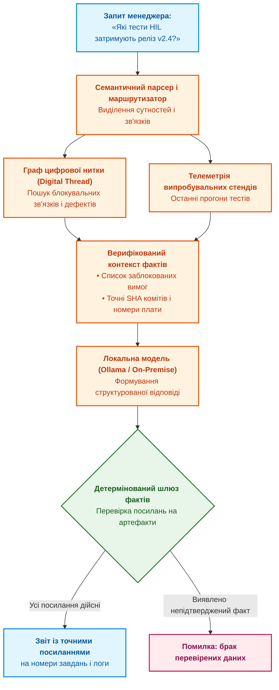

# Глава 17. ШІ-асистент проєктного менеджера: заземлення на цифрову нитку, виявлення блокерів та межі довіри

> **Книга:** [Керування складними інженерними проєктами та програмами](README.md) · [Частина VI](part-06-pmo-platform-strategy-ai.md)  
> **Попередня глава:** [Глава 16. Зрілість проєктного офісу (PMO) та стратегія платформи: створювати, купувати чи інтегрувати](ch16-pmo-maturity-and-platform-strategy.md)  
> **Наступна глава:** [Глава 18. Відповідальність і нагляд: люди в циклі рішень, запобігання управлінським галюцинаціям та етика](ch18-governance-and-human-accountability.md)  
> **Зміст книги:** [README.md](README.md)  
> **Автор:** [Микола Федчик](about-the-author.md)  
> **Рівень:** проєктні менеджери, ІТ-лідери, архітектори систем штучного інтелекту, технічні директори  
> **Очікувані результати:** розуміти межі застосування великих мовних моделей у менеджменті; будувати архітектуру заземленого ШІ-асистента над цифровою ниткою проєкту; формулювати перевірочні запити для виявлення прихованих затримок і розривів зв'язків; оцінювати достовірність відповідей алгоритмів.

---

## Чому звичайний чат-бот небезпечний для управління проєктами

З появою сучасних генеративних мовних моделей (LLM) у багатьох керівників виникла спокуса використовувати публічні чат-боти для управління розробкою: копіювати туди фрагменти переписок, описи задач і вимагати скласти звіт або розклад.

У сфері складних інженерних комплексів такий підхід несе критичні ризики:
1. **Витік конфіденційної інформації:** відправлення креслень, топології плат і алгоритмів на зовнішні сервери порушує договори про нерозголошення (NDA) та вимоги державної таємниці.
2. **Галюцинації та вигадки:** статистична модель намагається звучати переконливо, але не знає реального стану речей; вона може впевнено стверджувати, що тест пройдено, сплутавши дату або вигадавши номер ревізії.
3. **Відсутність посилань на першоджерела:** текстова генерація не створює юридичного сліду прийняття рішень.

Штучний інтелект у проєктному управлінні має право на існування виключно як **заземлений асистент (Grounded Assistant)**, розгорнутий локально й підключений до графа цифрової нитки підприємства [[1]](#src-1).

---

## Архітектура заземленого інженерного асистента

Архітектура спеціалізованого ШІ-помічника менеджера базується на принципах генерації з доповненою вибіркою (*Retrieval-Augmented Generation, RAG*) над інженерним графом знань:

Механізм роботи заземленого асистента:
1. Запит користувача транслюється в запит до бази даних цифрової нитки (Cypher, SQL або GraphQL).
2. Система витягує лише зафіксовані факти: номери ревізій, дати прогонів тестів, рішення ради змін CCB.
3. Локальна мовна модель виконує функцію мовного інтерфейсу: вона формулює лаконічну відповідь суворо на основі наданих фактів.
4. **Шлюз перевірки посилань:** система перевіряє, чи кожен згаданий у відповіді коміт чи дефект дійсно існує в цифровій нитці. Якщо модель намагається вигадати номер завдання, відповідь блокується.

---

## Типові сценарії допомоги інженерному менеджеру

Заземлений асистент розв'язує складні рутинні задачі аналізу даних:

### 1. Виявлення розірваних ланцюгів трасування
* *Запит менеджера:* «Чи є в базовій лінії v2.1 вимоги безпеки без призначеного тесту?».
* *Відповідь асистента:* «Знайдено 2 вимоги без тестів: `REQ-SAFE-104` (термінал аварійного скидання) та `REQ-SAFE-109` (захист від переполюсовки). Останній раз ці вимоги редагувалися в запиті CR-82».

### 2. Аналіз прихованого критичного шляху
* *Запит менеджера:* «Які завдання найбільше загрожують дедлайну 15 травня?».
* *Відповідь асистента:* «Завдання `WP-HW-402` (розведення плати живлення) має повний резерв часу 0 днів. Затримка постачання ШІМ-контролера на складі зміщує монтаж на 4 дні, що призведе до зриву стенду HIL».

---

## Висновок

Штучний інтелект у проєктному менеджменті є цінним аналітичним помічником, але лише за умови його суворого заземлення на факти цифрової нитки підприємства.

Використання локальних моделей, архітектури RAG над інженерними графами та автоматичних шлюзів перевірки посилань усуває небезпеку галюцинацій і захищає інтелектуальну власність компанії.

Проте остаточне рішення та відповідальність за людей і безпеку виробу завжди залишається за людиною. Цій філософській та практичній темі присвячена заключна глава книги.

Відкриває її [Глава 18. Відповідальність і нагляд: люди в циклі рішень, запобігання управлінським галюцинаціям та етика](ch18-governance-and-human-accountability.md).

---

## Питання для обговорення

1. Чому пряме використання комерційних публічних чат-ботів є неприпустимим під час управління конфіденційними апаратно-програмними розробками?
2. Яким чином архітектура RAG над графом цифрової нитки запобігає виникненню галюцинацій у відповідях штучного інтелекту?
3. Чому автоматичний шлюз фактів повинен перевіряти наявність кожного ідентифікатора артефакта, згенерованого мовною моделлю?
4. У яких конкретних аналітичних задачах проєктного менеджера застосування ШІ-асистента дає максимальний виграш у часі?
5. Чому ШІ-асистент повинен формулювати відповіді у форматі рекомендацій з посиланнями на докази, а не у формі безапеляційних директив?

---

## Словник

- **Галюцинація моделі:** генерація мовною моделлю статистично правдоподібного, але фактично хибного або вигаданого твердження.
- **Генерація з доповненою вибіркою (RAG):** архітектурний підхід, за якого мовна модель генерує відповідь на основі точних фактів, попередньо витягнутих із перевіреної зовнішньої бази даних чи графа.
- **Детермінований шлюз фактів:** програмний фільтр, що звіряє всі сутності та ідентифікатори у згенерованій відповіді з реальними записами в системі керування проєктом.
- **Заземлення (Grounding):** обмеження простору висновків штучного інтелекту суворо фактами, документами та зв'язками, підтвердженими першоджерелами.
- **Локальна мовна модель (On-Premise LLM):** штучний інтелект, розгорнутий на власних захищених серверах компанії без передавання даних у зовнішні хмари.

---

## Абревіатури

- **API** (*Application Programming Interface*): програмний інтерфейс взаємодії.
- **CI/CD** (*Continuous Integration / Continuous Delivery*): безперервна інтеграція та доставка.
- **HIL** (*Hardware-in-the-Loop*): стенд випробувань реального заліза.
- **LLM** (*Large Language Model*): велика мовна модель штучного інтелекту.
- **NDA** (*Non-Disclosure Agreement*): договір про нерозголошення конфіденційної інформації.
- **RAG** (*Retrieval-Augmented Generation*): генерація з доповненою вибіркою знань.
- **RTM** (*Requirements Traceability Matrix*): матриця простежуваності вимог.
- **SHA** (*Secure Hash Algorithm*): криптографічний геш-алгоритм.
- **WBS** (*Work Breakdown Structure*): структура декомпозиції робіт.

---

## Джерела

1. Patrick Lewis et al. [*Retrieval-Augmented Generation for Knowledge-Intensive NLP Tasks*](https://doi.org/10.48550/arXiv.2005.11401). Advances in Neural Information Processing Systems, 33:9459–9474, 2020.
2. Project Management Institute. [*AI in Project Management: Shaping the Future of Project Work*](https://www.pmi.org/). PMI Thought Leadership, 2023.
3. World Wide Web Consortium. [*PROV-DM: The PROV Data Model*](https://www.w3.org/TR/prov-dm/). W3C Recommendation, 2013.

---

[← До Частини VI](part-06-pmo-platform-strategy-ai.md) | [До змісту книги](README.md) | [Глава 18 →](ch18-governance-and-human-accountability.md)
