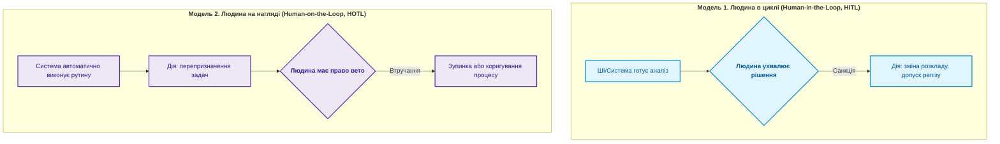

# Глава 18. Відповідальність і нагляд: люди в циклі рішень, запобігання управлінським галюцинаціям та етика

> **Книга:** [Керування складними інженерними проєктами та програмами](README.md) · [Частина VI](part-06-pmo-platform-strategy-ai.md)  
> **Попередня глава:** [Глава 17. ШІ-асистент проєктного менеджера: заземлення на цифрову нитку, виявлення блокерів та межі довіри](ch17-ai-assistants-in-project-management.md)  
> **Зміст книги:** [README.md](README.md)  
> **Автор:** [Микола Федчик](about-the-author.md)  
> **Рівень:** вище керівництво підприємств, генеральні конструктори, технічні директори, етичні та комплаєнс-офіцери  
> **Очікувані результати:** володіти принципами збереження людини в циклі управління (Human-in-the-Loop); запобігати управлінським галюцинаціям і сліпій довірі до алгоритмів; будувати систему збереження інженерної пам'яті підприємства; розуміти етичні та правові межі автоматизації менеджменту.

---

## Принцип неподільності управлінської відповідальності

У міру розвитку автоматизації, цифрової нитки та штучного інтелекту виникає небезпечна ілюзія: здається, що ухвалення складних інженерних і бізнес-рішень можна перекласти на комп'ютерні системи. Коли програма рекомендує перенести термін випуску чи проігнорувати попередження про вібрацію, менеджер має спокусу сказати: «Так вирішив алгоритм».

Це глибока помилка. **Алгоритм може розраховувати, рекомендувати та виявляти аномалії, але відповідальність завжди несе конкретна людина** [[1]](#src-1).

Якщо аварія безпілотника призведе до руйнувань, або медичний апарат дасть збій через помилку в розрахунку тепловідводу, перед судом, замовником і суспільством постане не нейромережа й не база даних, а головний конструктор і технічний директор підприємства.

---

## Моделі участі людини: Human-in-the-Loop проти Human-on-the-Loop

У сучасних високоавтоматизованих системах управління розрізняють два рівні залучення людини:

1. **Людина в циклі (Human-in-the-Loop, HITL):** застосовується для всіх критичних рішень:
   * затвердження нової базової лінії проекту;
   * внесення змін до вимог функціональної безпеки;
   * допуск релізу до серійного виробництва чи польотних тестів;
   * закриття або відкриття нового проєкту в портфелі.
   У цій моделі алгоритм готує пакет доказів, але дія не відбувається без свідомого електронного підпису уповноваженого лідера.

2. **Людина на нагляді (Human-on-the-Loop, HOTL):** застосовується для низькорівневих рутинних дій:
   * автоматичне створення задач у трекері за фактом провалу тесту на стенді;
   * перерахунок критичного шляху після коміту в репозиторій;
   * надсилання попереджень про перевищення ліміту WIP.
   Система діє автономно, але людина-оператор постійно бачить панель телеметрії й має можливість скасувати будь-яку дію за необхідності.

---

## Збереження корпоративної інженерної пам'яті

Найбільшим ризиком для високотехнологічної компанії є втрата накопиченого інженерного досвіду під час зміни поколінь фахівців. Провідний конструктор іде на пенсію, а разом із ним зникає розуміння того, чому саме десять років тому було обрано саме таку форму антени, або чому певний сплав алюмінію заборонено використовувати в цьому вузлі.

Нова команда повторює старі помилки, витрачаючи роки на повторні невдалі спроби.

Система управління, побудована на засадах цієї книги (цифрова нитка, незмінні журнали рішень CCB, заземлена база знань), виконує функцію **інституційної пам'яті підприємства** [[2]](#src-2):
* кожен відхилений запит на зміну зберігає опис причин невдачі;
* кожен негативний результат стендового тесту залишається доступним для пошуку;
* молодий інженер за секунди знаходить прецеденти аналогічних технічних проблем за останні п'ять років.

---

## Підсумок монографії: маніфест інженерної зрілості

Створення складних інженерних комплексів у XXI столітті вимагає відмови від спрощених рецептів:

1. **Від хаосу до спільної моделі:** відмовтеся від ізольованих островів даних на користь цифрової нитки артефактів.
2. **Від сподівань до детермінізму:** замініть суб'єктивні статусні презентації машинними шлюзами допуску та криптографічними пакетами доказів.
3. **Від перевантаження до фокусу:** керуйте розробкою за законами черг Літтла, обмежуйте незавершене виробництво та майте мужність своєчасно закривати неефективні проєкти.
4. **Від штучного хайпу до відповідальності:** використовуйте штучний інтелект як заземленого помічника, але пам'ятайте, що інженерну відповідальність за виріб, безпеку та людей несуть виключно інженерні лідери.

---

## Питання для обговорення

1. Чому спроба керівника виправдати технічний або розкладний провал виробу «рекомендацією алгоритму чи ШІ» є неприйнятною з професійної та юридичної точок зору?
2. У чому полягає різниця між моделями Human-in-the-Loop та Human-on-the-Loop, і які типи рішень категорично заборонено делегувати повній автономії?
3. Як незмінні журнали рішень ради змін CCB допомагають зберегти інженерну пам'ять організації під час звільнення провідних спеціалістів?
4. Які етичні ризики виникають у процесі впровадження автоматизованих алгоритмів оцінки продуктивності та навантаження інженерів?
5. Які перші три практичні кроки повинна зробити ваша інженерна компанія для переходу від традиційного «звітного менеджменту» до керованої цифрової нитки?

---

## Словник

- **Етика інженерної відповідальності:** сукупність професійних і моральних принципів, згідно з якими інженер несе пряму особисту відповідальність за безпеку, надійність та суспільні наслідки створених ним технічних систем.
- **Інституційна пам'ять (Corporate Memory):** сукупність накопичених технічних знань, досвіду, архітектурних рішень, прецедентів успіхів і задокументованих помилок організації.
- **Людина в циклі (Human-in-the-Loop, HITL):** модель управління, за якої жодна критична дія чи рішення не виконується системою без прямої усвідомленої санкції уповноваженої людини.
- **Людина на нагляді (Human-on-the-Loop, HOTL):** модель управління, за якої рутинні процеси відбуваються автоматично під безперервним моніторингом людини з можливістю оперативного втручання.
- **Управлінська галюцинація:** прийняття помилкового стратегічного чи інженерного рішення на основі викривлених, сфальсифікованих або згенерованих без заземлення на факти даних.

---

## Абревіатури

- **CCB** (*Change Control Board*): рада контролю змін.
- **HITL** (*Human-in-the-Loop*): людина в циклі прийняття рішень.
- **HOTL** (*Human-on-the-Loop*): людина на нагляді за процесом.
- **PMO** (*Project Management Office*): офіс управління проєктами.
- **R&D** (*Research and Development*): наукові дослідження та дослідно-конструкторські розробки.
- **WBS** (*Work Breakdown Structure*): структура декомпозиції робіт.
- **WIP** (*Work In Progress*): незавершене виробництво.

---

## Джерела

1. IEEE Global Initiative on Ethics of Autonomous and Intelligent Systems. [*Ethically Aligned Design: A Vision for Prioritizing Human Well-being with Autonomous and Intelligent Systems*](https://standards.ieee.org/industry-connections/ec/autonomous-systems.html), 1st Edition. IEEE, 2019.
2. International Council on Systems Engineering. [*INCOSE Systems Engineering Handbook: A Guide for System Life Cycle Processes and Activities*](https://doi.org/10.1002/9781119516828), 4th Edition. Wiley, 2015.
3. Project Management Institute. [*Code of Ethics and Professional Conduct*](https://www.pmi.org/about/ethics/code). PMI, 2020.

---

[← До Частини VI](part-06-pmo-platform-strategy-ai.md) | [До змісту книги](README.md) | [До Додатків →](appendix-a-standards-and-frameworks.md)
