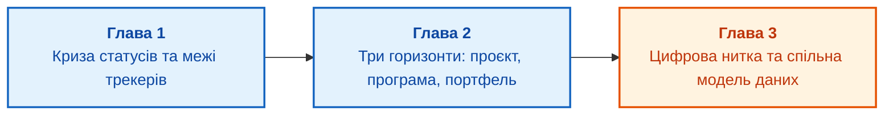

# Частина I. Системна модель та горизонти управління

[← До змісту книги](README.md) | [До Частини II →](part-02-planning-baselines-change-control.md)

---

## Мета частини

Мета цієї частини полягає в закладенні концептуального та структурного фундаменту для управління складними інженерними виробами:

1. **Інженерна криза розрізнених інструментів:** чому наявність трекера задач, репозиторію коду й таблиць не захищає команду від раптових зривів інтеграції перед контрольними точками?
2. **Розмежування трьох горизонтів:** чим різняться предметні області, часові масштаби та типи рішень на рівнях проєкту, програми та портфеля, і чому програма не є просто сумою статусів проєктів?
3. **Цифрова нитка інженерних артефактів:** як побудувати єдину модель даних, яка поєднує вимоги, декомпозицію робіт, архітектурні рішення, конфігурації компонентів, тести та докази готовності до релізу?

---

## Анотація теми та взаємозв'язку глав

У першій частині розгортається вихідна суперечність сучасного інженерного менеджменту: зростання складності виробів вимагає точних зв'язків між дисциплінами, тоді як інструменти команд залишаються локальними «островами автоматизації».

Ми розпочинаємо з аналізу типової кризи «зелених статусів», переходимо до суворого розмежування управлінських ролей на трьох горизонтах та завершуємо побудовою онтології цифрової нитки (*digital thread*), яка слугує спільним інформаційним хребтом для всіх подальших глав книги.

---

## Глави частини

### [Глава 1. Криза статусів: чому традиційний проєктний менеджмент не рятує складні вироби](ch01-engineering-management-in-crisis.md)
* **Анотація:** Чому команда з десятками виконаних задач у трекері раптово виявляє непрацездатність виробу під час системної інтеграції. Різниця між інформацією про активність і знанням про стан продукту. Межі традиційних дошок задач у розробці апаратно-програмних комплексів: відсутність фізичного контексту, ігнорування тривалих циклів закупівлі, невидимість змін у специфікаціях. Перехід від пасивного збирання звітів до обчислюваної моделі інженерного контексту.

### [Глава 2. Три горизонти: проєкт, програма, портфель і межі їхніх рішень](ch02-three-horizons-project-programme-portfolio.md)
* **Анотація:** Розподіл зон відповідальності в інженерній організації. Проєктний менеджер як лідер поставки конкретного результату (*delivery of output*). Програмний менеджер як координатор системної інтеграції, спільних ризиків і реалізації стратегічних вигод (*strategic outcome*). Портфельний керуючий як арбітр розподілу капіталу й виробничих спроможностей. Чому спроба підмінити програмне управління агрегацією звітів окремих проєктів гарантовано призводить до прихованого накопичення системних ризиків.

### [Глава 3. Цифрова нитка та єдина модель даних інженерного підприємства](ch03-digital-thread-and-engineering-data-model.md)
* **Анотація:** Концепція цифрової нитки (*digital thread*) як графа незмінних зв'язків між різнорідними артефактами. Онтологія сутностей: вимога, компонент, блок робіт (work package), ревізія друкованої плати, бінарний образ прошивки, стендовий тест, ризик, зміна. Забезпечення двоспрямованої простежуваності (*bidirectional traceability*). Подолання фрагментації між PLM, ALM, ERP і системами керування версіями без створення неповоротких монолітних баз даних.

---

[← Зміст книги](README.md) | [До Частини II →](part-02-planning-baselines-change-control.md)
