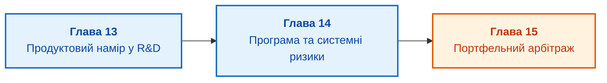

# Частина V. Продуктовий намір, програма та портфель

[← До Частини IV](part-04-continuous-compliance-release-evidence.md) | [До змісту книги](README.md) | [До Частини VI →](part-06-pmo-platform-strategy-ai.md)

---

## Мета частини

Мета цієї частини полягає в подоланні розриву між бізнес-стратегією, продуктовим баченням та інженерним виконанням на рівнях програми й портфеля:

1. **Продуктовий намір в апаратно-програмній інженерії:** чим відрізняється роль технічного продуктового менеджера у складних R&D-проєктах від класичного Product Owner у веб-сервісах, і як транслювати потреби ринку в системні інженерні обмеження?
2. **Системні ризики та вигоди програми:** як програмному менеджеру керувати спільними ризиками, координувати інтеграційні вікна між кількома незалежними командами та забезпечувати реалізацію стратегічних результатів (*benefits realization*)?
3. **Портфельний арбітраж і закриття проєктів:** як розподіляти обмежені фінансові й інженерні ресурси між ініціативами, будувати стадійні фільтри (*Stage-Gate*) та мати сміливість вчасно зупиняти безнадійні розробки?

---

## Анотація теми та взаємозв'язку глав

У п'ятій частині ми піднімаємося на вищі щаблі управлінської ієрархії. Навіть ідеально організований проєкт із вивіреним WBS зазнає краху, якщо створює непотрібний ринку виріб, або якщо ресурси організації розпорошені між сотнею паралельних ініціатив без пріоритетів.

Ми досліджуємо взаємодію між продуктовим наміром (*product intent*) та технічною реалізацією, розкриваємо специфіку програмного управління як координації системних ефектів і залежностей, та пропонуємо прозору математичну й процесну модель портфельного управління для фінансування та своєчасного закриття проєктів.

---

## Глави частини

### [Глава 13. Продуктовий менеджмент в інженерних дослідженнях: намір, обмеження та системний беклог](ch13-product-management-in-rd.md)
* **Анотація:** Продуктовий менеджмент у сфері досліджень та розробок (*R&D*). Розмежування ролей комерційного та технічного продуктового менеджера. Як формулювати продуктовий намір (*Product Intent*) без передчасного нав'язування архітектурних рішень. Трансляція бізнес-вимог у системні атрибути якості, інтерфейсні угоди та енергетично-масові бюджети (SWaP-C). Формування системного беклогу: узгодження вимог замовника з технічним боргом і технологічними дослідженнями (Spikes).

### [Глава 14. Управління програмою: пулінг системних ризиків, інтеграційні вікна та вигоди](ch14-programme-management-and-systemic-risk.md)
* **Анотація:** Чому програма не є великим проєктом і не зводиться до суми підпроєктів. Пулінг системних ризиків (*risk pooling*): як спільні невизначеності на стику апаратури й софту нейтралізуються на програмному рівні. Проєктування інтеграційних вікон (*integration windows*) і релізних поїздів. Управління досягненням стратегічних вигод (*Benefits Realization Management*): перевірка життєздатності продукту після розгортання в експлуатації.

### [Глава 15. Портфельне управління: як обирати, фінансувати, перерозподіляти ресурси та вчасно зупиняти проєкти](ch15-portfolio-governance-and-capital-allocation.md)
* **Анотація:** Портфель як механізм реалізації стратегії в умовах дефіциту інженерних талантів і бюджету. Модель стадійно-шлюзового фінансування (*Stage-Gate Process*). Критерії ранжування ініціатив: очікувана чиста приведена вартість (eNPV), стратегічна відповідність, ризик виконання. Головний виклик портфельного комітету: чому почати проєкт легко, а закрити майже неможливо. Критерії та правила своєчасного закриття неефективних ініціатив (*killing projects*) без демотивації команд.

---

[← До Частини IV](part-04-continuous-compliance-release-evidence.md) | [До змісту книги](README.md) | [До Частини VI →](part-06-pmo-platform-strategy-ai.md)
