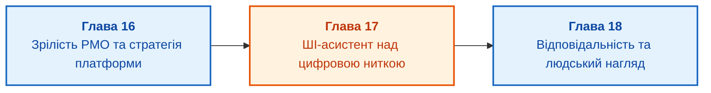

# Частина VI. Платформа, сучасний PMO та штучний інтелект

[← До Частини V](part-05-product-programme-portfolio.md) | [До змісту книги](README.md) | [До Додатків →](appendix-a-standards-and-frameworks.md)

---

## Мета частини

Мета цієї частини полягає в синтезі організаційних, інструментальних та інтелектуальних складових сучасної системи управління:

1. **Еволюція та зрілість PMO:** як перетворити проєктний офіс із бюрократичного генератора звітів на центр інженерної аналітики, фасилітації рішень і стандартизації практик?
2. **Стратегія управлінської платформи:** як ухвалити зважене рішення «створювати, купувати чи інтегрувати» (*Build vs Buy vs Assemble*) для інфраструктури управління проєктами й програмами?
3. **Штучний інтелект у менеджменті:** як побудувати спеціалізованого ШІ-асистента, здатного аналізувати граф цифрової нитки, виявляти приховані блокери й пропонувати дії без вигадок і галюцинацій?
4. **Контроль та інженерна відповідальність:** чому людина завжди повинна залишатися суб'єктом остаточного рішення (*Human-in-the-Loop*), та як запобігти управлінській деградації під час делегування аналітики алгоритмам?

---

## Анотація теми та взаємозв'язку глав

У заключній шостій частині монографії ми розглядаємо інфраструктуру, яка підтримує описані методики на рівні підприємства. Жодна передова методологія не працюватиме без відповідної організаційної культури, зрілих процесів та інтегрованого інструментального стека.

Ми аналізуємо рівні зрілості PMO, формулюємо критерії вибору систем керування розробкою, досліджуємо архітектуру заземлених ШІ-помічників для проєктних команд та розглядаємо етичні й правові рамки відповідальності лідера за результати складних інженерних систем.

---

## Глави частини

### [Глава 16. Зрілість проєктного офісу (PMO) та стратегія платформи: створювати, купувати чи інтегрувати](ch16-pmo-maturity-and-platform-strategy.md)
* **Анотація:** Еволюційні сходинки проєктного офісу: від рівня 0 (індивідуальне ручне управління) до рівня 4 (оптимізована самонавчальна організація). Ролі PMO: підтримуючий, контролюючий, директивний та аналітичний. Стратегія побудови цифрової платформи управління: аналіз переваг і прихованих витрат комерційних монолітів проти власної розробки та коннекторів над відкритими стандартами (OSLC). Критерії вибору інструментарію для високотехнологічних підприємств.

### [Глава 17. ШІ-асистент проєктного менеджера: заземлення на цифрову нитку, виявлення блокерів та межі довіри](ch17-ai-assistants-in-project-management.md)
* **Анотація:** Архітектура інтелектуального асистента для інженерного менеджменту. Чому звичайний чат із LLM непридатний для ухвалення рішень. Механізм заземлення (*grounding*): запити над графом артефактів цифрової нитки, пошук аномалій у часових рядах метрик, виявлення розірваних ланцюгів вимог. Побудова зрозумілих пояснень (*explainability*): надання конкретних посилань на коміти, звіти та протоколи CCB разом із кожною рекомендацією.

### [Глава 18. Відповідальність і нагляд: люди в циклі рішень, запобігання управлінським галюцинаціям та етика](ch18-governance-and-human-accountability.md)
* **Анотація:** Принцип неподільності управлінської відповідальності: алгоритм може радити, людина зобов'язана вирішувати. Захист від управлінських галюцинацій та сліпої довіри до автоматизованих порад. Моделі автономності: Людина в циклі (*Human-in-the-Loop*) та Людина на нагляді (*Human-on-the-Loop*). Збереження корпоративної інженерної пам'яті під час зміни поколінь спеціалістів. Висновок монографії та бачення майбутнього інженерного менеджменту.

---

[← До Частини V](part-05-product-programme-portfolio.md) | [До змісту книги](README.md) | [До Додатків →](appendix-a-standards-and-frameworks.md)
